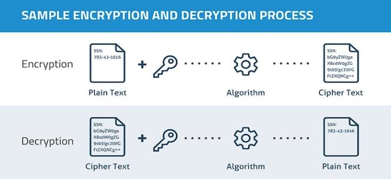
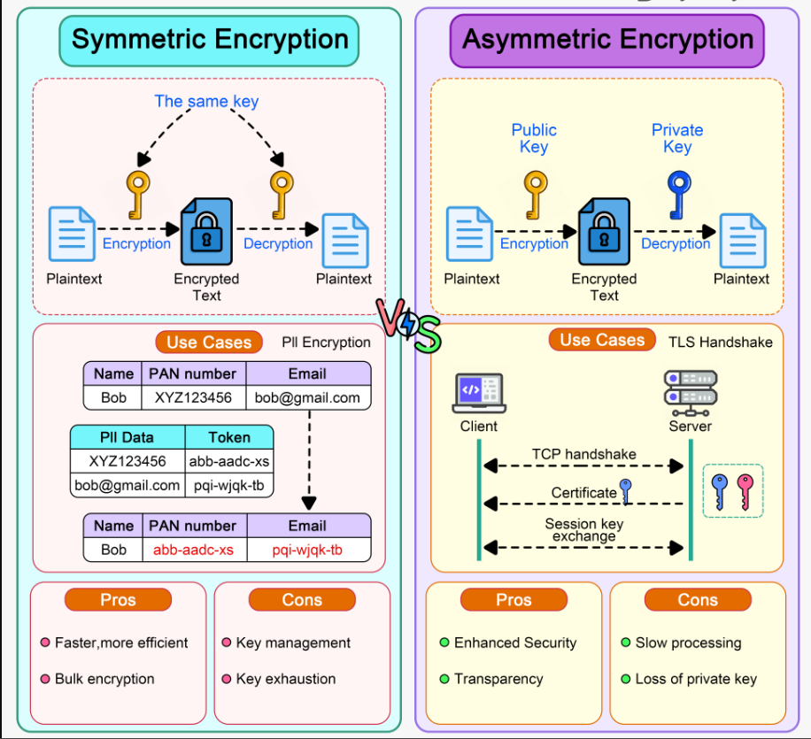
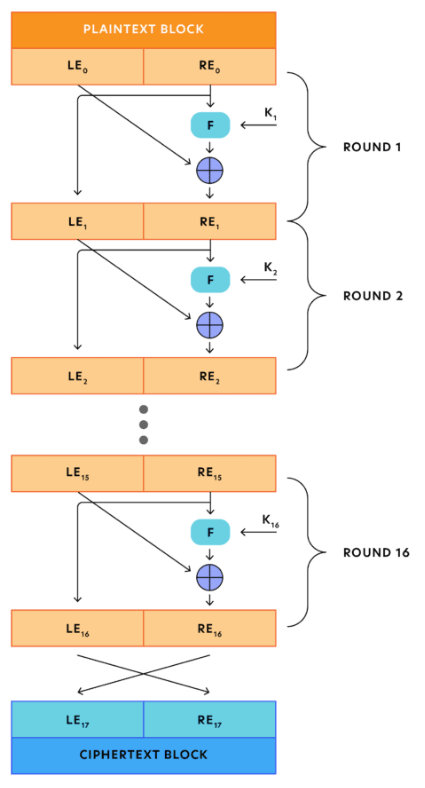
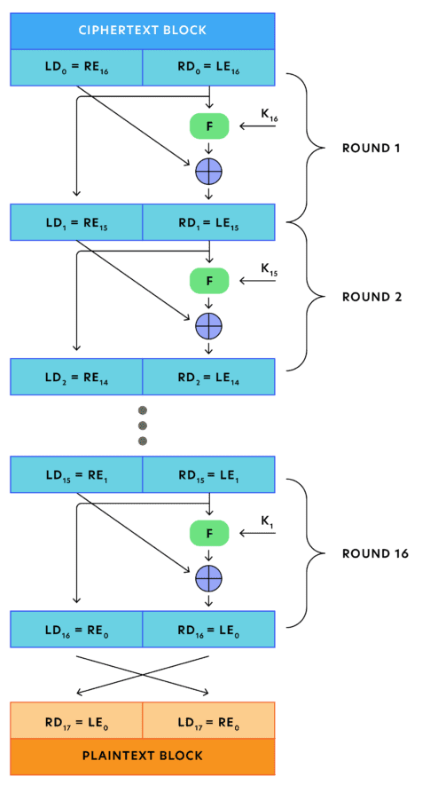
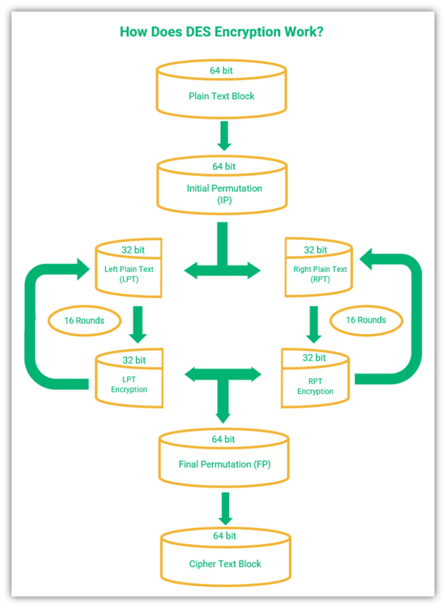
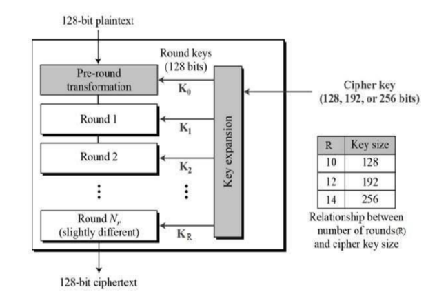
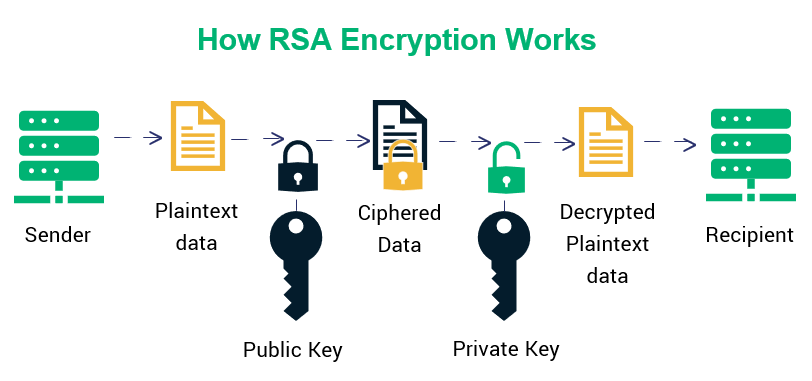

<div align="center">

[**_``Go Back``_**](../README.md)

</div>

# Cryptographic Algorithms

**Cryptography** is a process of hiding transmitted information by the sender such that it may be read only by the intended recipient. Cryptography is widely used in various fields such as end-to-end messaging, banking and finance, secure web communication, and access control.

**What are Cryptographic Algorithms?**

A **cryptographic algorithm** is a set of steps that can be used to convert plain text into cipher text. A cryptographic algorithm is also known as an encryption algorithm.



An original message is known as the ``plaintext``, while the coded message is called the ``ciphertext``.

The process of converting from ``plaintext`` to ``ciphertext`` is known as ``enciphering`` or ``encryption``; restoring the plaintext from the ``ciphertext`` is ``deciphering`` or ``decryption``.

The many schemes used for encryption constitute the area of study known as ``cryptography``. Such a scheme is known as a ``cryptographic system`` or a ``cipher``.

Techniques used for deciphering a message without any knowledge of the enciphering details fall into the area of ``cryptanalysis``. ``Cryptanalysis`` is what the layperson calls “breaking the code”. The areas of cryptography and cryptanalysis together are called ``cryptology``.

## Classical Cryptosystems: Ceasar, Vigenere, Playfair, Rail Fence Ciphers

**Classical cryptosystems** are some of the earliest methods used to encrypt messages. These methods are generally simpler than modern cryptographic techniques but were effective in their time. Here are brief explanations of four classical cryptosystems:

### Caesar cipher

The **Caesar cipher** is a type of substitution cipher where each letter in the plaintext is shifted a certain number of places down or up the alphabet. It is named after ``Julius Caesar``, who reportedly used this encryption technique to protect his messages.

#### How It Works:

1. **Choose a shift value:** This is the number of positions each letter in the plaintext will be shifted.

2. **Shift each letter in the plaintext by the chosen shift value:** If the shift value is ``positive``, shift to the ``right``; if ``negative``, shift to the ``left``.

3. **Wrap around the alphabet if necessary:** For example, if you shift ``"Z"`` by ``1``, it becomes ``"A"``.

#### Example:
Let's use a shift of ``3`` for our example.

- **Plaintext:** ``"HELLO"``
- **Shift:** 3

##### Encryption Process:

Process:

- ``"H"`` (shifted by 3) -> ``"K"``
- ``"E"`` (shifted by 3) -> ``"H"``
- ``"L"`` (shifted by 3) -> ``"O"``
- ``"L"`` (shifted by 3) -> ``"O"``
- ``"O"`` (shifted by 3) -> ``"R"``

So, the ciphertext for ``"HELLO"`` with a shift of ``3`` is ``"KHOOR"``.

##### Decryption Process:
To decrypt the message, you simply shift each letter in the ciphertext by the negative of the original shift value.

- **Ciphertext:** ``"KHOOR"``
- **Shift:** -3

Process:

- ``"K"`` (shifted by -3) -> ``"H"``
- ``"H"`` (shifted by -3) -> ``"E"``
- ``"O"`` (shifted by -3) -> ``"L"``
- ``"O"`` (shifted by -3) -> ``"L"``
- ``"R"`` (shifted by -3) -> ``"O"``

So, the plaintext for ``"KHOOR"`` with a shift of ``-3`` is ``"HELLO"``.

### Vigenère Cipher

The **Vigenère cipher** is a method of encrypting alphabetic text by using a simple form of polyalphabetic substitution. It uses a keyword to determine the shift for each letter in the plaintext.

#### Step-by-Step Encryption Process:

1. **Choose a Keyword:**
    - The keyword will determine the shift for each letter in the plaintext.
    - Example Keyword: ``"KEY"``
2. **Repeat the Keyword to Match the Length of the Plaintext:**
    - Repeat the keyword until it matches the length of the plaintext.
    - Example Plaintext: ``"HELLO"``
    - Repeated Keyword: ``"KEYKE"``
3. **Write Down the Alphabet:**
    - Use the standard alphabet for reference.
    - Alphabet: ``A`` ``B`` ``C`` ``D`` ``E`` ``F`` ``G`` ``H`` ``I`` ``J`` ``K`` ``L`` ``M`` ``N`` ``O`` ``P`` ``Q`` ``R`` ``S`` ``T`` ``U`` ``V`` ``W`` ``X`` ``Y`` ``Z``
3. **Encryption Process:**
    - For each letter in the plaintext, find the corresponding letter in the keyword and shift the plaintext letter by the position of the keyword letter in the alphabet.
    - Convert both the plaintext and keyword letters to their numeric positions (``A=0``, ``B=1``, ... , ``Z=25``).
    - Add the numeric positions together and take the result modulo ``26`` to get the encrypted letter.
    - Convert the result back to a letter.

##### Example:

- **Plaintext:** ``"HELLO"``
- **Keyword:** ``"KEYKE"``

Encryption Process:

- ``"H"`` (position 7) + ``"K"`` (position 10) = ``"R"`` (position 17)
- ``"E"`` (position 4) + ``"E"`` (position 4) = ``"I"`` (position 8)
- ``"L"`` (position 11) + ``"Y"`` (position 24) = ``"J"`` (position 9)
- ``"L"`` (position 11) + ``"K"`` (position 10) = ``"V"`` (position 21)
- ``"O"`` (position 14) + ``"E"`` (position 4) = ``"S"`` (position 18)

So, the ciphertext for ``"HELLO"`` with the keyword ``"KEY"`` is ``"RIJVS"``.

#### Step-by-Step Decryption Process:

1. **Use the Same Keyword:**
    - The same keyword used for encryption is used for decryption.
    - Example Keyword: ``"KEY"``

2. **Repeat the Keyword to Match the Length of the Ciphertext:**
    - Repeat the keyword until it matches the length of the ciphertext.
    - Example Ciphertext: ``"RIJVS"``
    - Repeated Keyword: ``"KEYKE"``

3. **Decryption Process:**
    - For each letter in the ciphertext, find the corresponding letter in the keyword and shift the ciphertext letter backward by the position of the keyword letter in the alphabet.
    - Convert both the ciphertext and keyword letters to their numeric positions (``A=0``, ``B=1``, ..., ``Z=25``).
    - Subtract the numeric position of the keyword letter from the ciphertext letter and take the result modulo ``26`` to get the decrypted letter.
    - Convert the result back to a letter.

##### Example:

- **Ciphertext:** ``"RIJVS"``
- **Keyword:** ``"KEYKE"``

Decryption Steps:

- ``"R"``(position 17) - ``"K"`` (position 10) = ``"H"`` (position 7)
- ``"I"`` (position 8) - ``"E"`` (position 4) = ``"E"`` (position 4)
- ``"J"`` (position 9) - ``"Y"`` (position 24) = ``"L"`` (position 11)
- ``"V"`` (position 21) - ``"K"`` (position 10) = ``"L"`` (position 11)
- ``"S"`` (position 18) - ``"E"`` (position 4) = ``"O"`` (position 14)

So, the plaintext for ``"RIJVS"`` with the keyword ``"KEY"`` is ``"HELLO"``.

### Playfair Cipher 

The Playfair cipher is a digraph substitution cipher that encrypts pairs of letters (digraphs) rather than individual letters. It was invented by Charles Wheatstone in 1854 but bears the name of Lord Playfair for promoting its use. The Playfair cipher is more secure than simple substitution ciphers, such as the Caesar cipher, because it works on two letters at once.

#### Step-by-Step Encryption Process:

1. **Choose a Key:**
    - Select a keyword for generating the ``5x5`` grid of letters.
    - Example Keyword: ``"KEY"``

2. **Create the 5x5 Grid:**
    - Remove duplicate letters from the keyword and arrange the letters in a ``5x5`` grid.
    - Use only 25 letters, treating ``I`` and ``J`` as the same letter.
    - Fill the remaining spaces in the grid with the rest of the alphabet in order.

        **Playfair Grid:**

        |     |  1  |  2  |  3  |  4  |  5  |
        |-----|-----|-----|-----|-----|-----|
        |  1  |  K  |  E  |  Y  |  A  |  B  |
        |  2  |  C  |  D  |  F  |  G  |  H  |
        |  3  |  I/J|  L  |  M  |  N  |  O  |
        |  4  |  P  |  Q  |  R  |  S  |  T  |
        |  5  |  U  |  V  |  W  |  X  |  Z  |

3. **Prepare the Plaintext:**
    - Divide the plaintext message into digraphs (pairs of letters).
    - If there is an odd number of letters, insert a filler character (usually ``X``) between repeating letters or at the end.

        **Example Plaintext:**
        - Plaintext: ``"HELLO"``
        - After forming digraphs: ``"HE"`` ``"LX"`` ``"LO"`` (added an ``X`` to separate the repeating ``L``)

4. **Encrypt the Digraphs**: For each pair of letters:

    - If both letters are in the same ``row``, replace each with the letter immediately to its ``right`` (wrap around to the start of the row if necessary).
    - If both letters are in the same ``column``, replace each with the letter immediately below it (wrap around to the top of the column if necessary).
    - If the letters form a ``rectangle``, replace each letter with the letter on the same ``row`` but in the other corner of the rectangle.

Encryption Process:

- Digraph 1: ``"HE"``
    - ``H`` is at ``row 2``, ``column 5``.
    - ``E`` is at ``row 1``, ``column 2``.
    - They form a rectangle. Swap them with the letters in ``row 2``, ``column 2 (D)`` and ``row 1``, ``column 5 (B)``.
    - ``"HE"`` → ``"DB"``

- Digraph 2: ``"LX"``
    - ``L`` is at ``row 3``, ``column 2``.
    - ``X`` is at ``row 5``, ``column 4``.
    - They form a rectangle. Swap them with the letters in ``row 3``, ``column 4 (N)`` and ``row 5``, ``column 2 (V)``.
    - ``"LX"`` → ``"NV"``

- Digraph 3: ``"LO"``
    - ``L`` is at ``row 3``, ``column 2``.
    - ``O`` is at ``row 3``, ``column 5``.
    - They are in the same row. Shift each letter to the right.
    - ``L`` becomes ``M (column 3)``, and ``O`` becomes ``I (column 1)``.
    - ``"LO"`` → ``"MI"``

- So, the final ciphertext is ``"DB NV MI"``

#### Step-by-Step Decryption Process:

To decrypt the ciphertext, you follow the reverse rules:

1. **Recreate the Grid**: Use the same grid created with the key ``"KEY"``.

    **Playfair Grid:**

    |     |  1  |  2  |  3  |  4  |  5  |
    |-----|-----|-----|-----|-----|-----|
    |  1  |  K  |  E  |  Y  |  A  |  B  |
    |  2  |  C  |  D  |  F  |  G  |  H  |
    |  3  |  I/J|  L  |  M  |  N  |  O  |
    |  4  |  P  |  Q  |  R  |  S  |  T  |
    |  5  |  U  |  V  |  W  |  X  |  Z  |

2. **Decrypt the Digraphs**: For each pair of letters:

- If both letters are in the same ``row``, replace each with the letter immediately to its ``left``.
- If both letters are in the same ``column``, replace each with the letter immediately ``above``.
- If the letters form a ``rectangle``, swap them with the letters in the same row but in the ``opposite`` corners.

Decryption Process:

- Digraph 1: ``"DB"``
    - ``D`` is at ``row 2``, ``column 2``.
    - ``B`` is at ``row 1``, ``column 5``.
    - They form a rectangle. Swap them with the letters in ``row 2``,`` column 5 (H)`` and ``row 1``,`` column 2 (E)``.
    - ``"DB"`` → ``"HE"``

- Digraph 2: ``"NV"``
    - ``N`` is at ``row 3``, ``column 4``.
    - ``V`` is at ``row 5``, ``column 2``.
    - They form a rectangle. Swap them with the letters in ``row 3``, ``column 2 (L)`` and ``row 5``, ``column 4 (X)``.
    - ``"NV"`` → ``"LX"``

- Digraph 3: ``"MI"``
    - ``M`` is at ``row 3``, ``column 3``.
    - ``I`` is at ``row 3``, ``column 1``.
    - They are in the same row. Shift each letter to the left.
    ``M`` becomes ``L (column 2)``, and ``I`` becomes ``O (column 5)``.
    - ``"MI"`` → ``"LO"``

- After decryption, the digraphs are ``"HE LX LO"``. Remove the extra ``X`` to get the original message: ``"HELLO"``.

### Rail Fence Cipher

The Rail Fence Cipher is a form of transposition cipher where the characters of the plaintext are written in a zigzag pattern across multiple rows (rails) and then read row by row to form the ciphertext. It is one of the simplest forms of encryption.

#### Step-by-Step Encryption Process:

##### 1. Choose the Number of Rails (Rows):
- The number of rails determines the zigzag pattern.
- Example: Use 3 rails for the plaintext `"HELLO WORLD"`.

##### 2. Write the Plaintext in a Zigzag Pattern:
- Write the characters of the message in a zigzag manner across the rails.
- Example for 3 rails and `"HELLO WORLD"`:

|     |     |     |     |     |     |     |     |     |     |
|-----|-----|-----|-----|-----|-----|-----|-----|-----|-----|
|``H``|     |     |     |``O``|     |     |     |``L``|     |
|     |``E``|     |``L``|     |``W``|     |``R``|     |``D``|
|     |     |``L``|     |     |     |``O``|     |     |     |

##### 3. Read the Message Row by Row:
- Read each rail sequentially from top to bottom to get the ciphertext.
- Example Ciphertext for `"HELLO WORLD"` (3 rails):

```
HOL ELWRD LO
```
The final ciphertext is ``"HOLELWRDLO"``.

#### Step-by-Step Decryption Process:

##### 1. Reconstruct the Zigzag Pattern:
- To decrypt, first calculate how many characters belong to each rail based on the length of the ciphertext and the number of rails.

##### 2. Fill the Zigzag Pattern with the Ciphertext:
- Write the ciphertext back in the zigzag pattern row by row.

##### 3. Read the Message Diagonally:
- Finally, read the zigzag pattern diagonally to recover the original message.
  
Example:
- **Ciphertext**: `"HOLELWRDLO"`
- **Number of Rails**: 3

**Decryption Process:**

1. **Reconstruct the zigzag pattern:**

|     |     |     |     |     |     |     |     |     |     |
|-----|-----|-----|-----|-----|-----|-----|-----|-----|-----|
|``H``|     |     |     |``O``|     |     |     |``L``|     |
|     |``E``|     |``L``|     |``W``|     |``R``|     |``D``|
|     |     |``L``|     |     |     |``O``|     |     |     |

2. **Read the message diagonally**: ``"HELLO WORLD"``.

Thus, the decrypted message is ``"HELLO WORLD"``.

The Rail Fence Cipher offers basic encryption, and though easy to implement, it is relatively insecure for modern applications.

## Modern Ciphers: Block vs. Stream Ciphers, Symmetric vs. Asymmetric Ciphers

Modern encryption techniques are essential for securing data in today’s digital world. Encryption ciphers can be broadly categorized into two key concepts: 

- how data is processed (Block vs. Stream) 
- how keys are used (Symmetric vs. Asymmetric).

### Block vs. Stream Ciphers

Both Block and Stream ciphers are methods of encryption that convert plaintext into ciphertext and belong to the family of symmetric key ciphers.

- **Block Cipher**: Encrypts the message by breaking it into fixed-size blocks and encrypting one block at a time.  
  Example: For the message "STREET_BY_STREET," using block cipher, "STREET" is encrypted first, followed by "_BY_," and then "STREET."

- **Stream Cipher**: Encrypts one byte of the message at a time.  
  Example: The message "blue sky" in ASCII is converted into binary (e.g., 010111001) and encrypted bit by bit.

---

#### Differences Between Block Cipher and Stream Cipher

| SN  | Key                          | Block Cipher                                                                     | Stream Cipher                                                               |
|-----|------------------------------|----------------------------------------------------------------------------------|-----------------------------------------------------------------------------|
| 1   | **Definition**               | Block Cipher encrypts plaintext by taking it block by block.                     | Stream Cipher encrypts plaintext one byte at a time.                        |
| 2   | **Conversion of bits**       | Encrypts a larger number of bits at once (64 bits or more).                      | Encrypts smaller amounts, usually 8 bits at a time.                         |
| 3   | **Principle**                | Uses both confusion and diffusion principles.                                    | Uses only the confusion principle.                                          |
| 4   | **Algorithm**                | Uses algorithms like Electronic Code Book (ECB) and Cipher Block Chaining (CBC). | Uses algorithms like Cipher Feedback (CFB) and Output Feedback (OFB).       |
| 5   | **Decryption**               | Decryption is more complex due to the larger number of bits involved.            | Decryption is simpler, as it often uses XOR, which can be easily reversed.  |
| 6   | **Implementation**           | Implemented using Feistel Cipher.                                                | Implemented using Vernam Cipher.                                            |
| 7   | **Complexity**               | Has a simpler design.                                                            | Comparatively more complex.                                                 |
| 8   | **No. of bits used**         | Typically 64 bits or more.                                                       | Typically 8 bits.                                                           |

--- 

**Summary**:  
Block ciphers handle data in larger, fixed-size chunks, while stream ciphers process data continuously in smaller pieces. Both have specific use cases based on the nature of the data and the required level of encryption.


### Symmetric vs. Asymmetric Ciphers

Cryptography relies on two main types of encryption: **symmetric** and **asymmetric** ciphers. Both are essential for ensuring data confidentiality, but they differ in key management, speed, and security applications.

#### Symmetric Ciphers

**Symmetric ciphers** use the same key for both encryption and decryption. The sender and receiver must share this secret key securely before communication.

##### Key Features of Symmetric Ciphers:

- **Same Key for Encryption & Decryption**: The same key is used to encode and decode the message.
- **Speed**: Generally faster than asymmetric encryption due to simpler algorithms.
- **Security Concern**: Key distribution can be a challenge since both parties need to keep the key secret and share it securely.
- **Common Algorithms**: AES (Advanced Encryption Standard), DES (Data Encryption Standard), 3DES (Triple DES), and Blowfish.

#### Asymmetric Ciphers

**Asymmetric ciphers** use a pair of keys: one for encryption (public key) and another for decryption (private key). The public key is shared with everyone, while the private key remains secret with the receiver.

##### Key Features of Asymmetric Ciphers:

- **Public & Private Keys**: A pair of keys is used—one public key for encryption and a private key for decryption.
- **Security**: More secure since only the private key can decrypt the message encrypted by the public key.
- **Slower**: Asymmetric encryption is computationally more expensive and slower than symmetric encryption.
- **Common Algorithms**: RSA (Rivest-Shamir-Adleman), ECC (Elliptic Curve Cryptography), and DSA (Digital Signature Algorithm).

---

##### Differences Between Symmetric and Asymmetric Ciphers




| SN  | Key                         | Symmetric Ciphers                                                             | Asymmetric Ciphers                                                             |
|-----|-----------------------------|-------------------------------------------------------------------------------|--------------------------------------------------------------------------------|
| 1   | **Key Usage**               | Uses the same key for both encryption and decryption.                         | Uses a public key for encryption and a private key for decryption.             |
| 2   | **Speed**                   | Faster encryption and decryption processes.                                   | Slower due to complex mathematical operations.                                 |
| 3   | **Security**                | Security depends on keeping the shared key secret.                            | More secure as the private key is never shared.                                |
| 4   | **Key Distribution**        | Key distribution can be difficult and needs a secure channel.                 | Public keys can be shared openly without compromising security.                |
| 5   | **Common Algorithms**       | AES, DES, 3DES, Blowfish.                                                     | RSA, ECC, DSA.                                                                 |
| 6   | **Use Cases**               | Often used for bulk data encryption (e.g., file encryption, disk encryption). | Commonly used for secure key exchange, digital signatures, and email security. |

---

**Summary**:  
Symmetric ciphers offer faster encryption but require secure key sharing, whereas asymmetric ciphers provide higher security and ease of key distribution but are slower. In modern cryptography, both types are often used together in hybrid encryption systems, where asymmetric encryption secures the key exchange, and symmetric encryption handles the data encryption.

## Symmetric Encryption: Fiestel Cipher Structure, Data Encryption Standards (DES), Basic Concepts of Fields: Groups, Rings, Fields, Modular Arithmetic, Galois Fields, Polynomial Arithmetic, Advanced Encryption Standards (AES)

### Fiestel Cipher Structure

**Feistel cipher** is a **symmetric block cipher design model**, used to create various encryption algorithms like DES (Data Encryption Standard). It divides plaintext into two halves and processes them through multiple rounds of encryption, involving both substitution and permutation steps.

Key aspects of Feistel ciphers:

- ``Block size``: Larger blocks provide more security but slow down the encryption process.
- ``Key size``: Larger keys (e.g., 128-bit) enhance security.
- ``Rounds``: More rounds generally increase security but add complexity.
- ``Round function``: Complexity boosts security.
- ``Subkey generation``: Complex subkeys make decryption harder for attackers.

#### Encryption Process

The Feistel cipher encryption process involves dividing the plaintext into fixed-size blocks and further splitting each block into two halves: **LE0** (left) and **RE0** (right). The encryption algorithm applies a round function to the right half (**REi**) and a key (**Ki**) in each round, and the result is XORed with the left half (**LEi**). The halves are then swapped. This process of substitution (via the round function) and permutation (swapping halves) is repeated over multiple rounds until the ciphertext is produced.



##### Key Steps:

1. **Splitting the Plaintext**:
   - Divide the plaintext into two halves: left (**LE0**) and right (**RE0**).

2. **Round Function and XOR**:
   - Apply the round function to the right half (**REi**) with key (**Ki**), then XOR with the left half (**LEi**).

3. **Permutation**:
   - Swap the two halves for the next round.

4. **Repeat**:
   - Continue this process for multiple rounds to produce the ciphertext.

#### Decryption Process

In the Feistel cipher, the same algorithm is used for both encryption and decryption.



##### Key Steps:

1. **Ciphertext Division**:
   - The ciphertext block is divided into two halves:
     - **LD0** (Left half)
     - **RD0** (Right half)

2. **Round Function Application**:
   - The round function is applied to the right half (**RD0**) with the key (**K16**) from the last encryption round.
   - The result is XORed with the left half (**LD0**).

3. **XOR and Swap**:
   - The XOR result becomes the new right half (**RD1**).
   - The original right half (**RD0**) switches to become the new left half (**LD1**) for the next round.

4. **Repeat**:
   - This process is repeated in reverse order for all rounds.
   - Once the fixed number of rounds is completed, the original plaintext block is recovered.

### Data Encryption Standard (DES)

The **Data Encryption Standard (DES)** is a symmetric-key block cipher published by the **National Institute of Standards and Technology (NIST)**. It is an implementation of the Feistel Cipher and operates using a **16-round Feistel structure**. The block size for DES is 64-bit.

#### Key Characteristics of DES

1. **Key Length**: 
   - The initial key is 64 bits long, but only **56 bits** are used in the encryption process. Every 8th bit (positions 8, 16, 24, 32, 40, 48, 56, and 64) is discarded and functions as check bits.
   
2. **Block Size**: 
   - DES operates on blocks of **64 bits**. This means that 64 bits of plaintext are processed to produce 64 bits of ciphertext.

3. **Encryption and Decryption**:
   - The same algorithm and key are used for both encryption and decryption, with only minor differences in how the key is applied.

4. **Decline in Popularity**:
   - DES has been found vulnerable to powerful cryptographic attacks, leading to its decline in use. The key length of 56 bits is no longer considered secure against brute-force attacks.

#### Broad-Level Steps in DES

1. **Initial Key Processing**:
   - Before encryption begins, the 64-bit key is reduced to **56 bits** by discarding every 8th bit.

2. **Substitution and Transposition**:
   - DES is based on two fundamental principles of cryptography:
     - **Substitution** (also known as **confusion**).
     - **Transposition** (also known as **diffusion**).
   - These principles are implemented across 16 rounds, each performing substitution and transposition.

3. **Encryption Process**:

   - **Step 1**: The 64-bit plaintext block is passed to the **Initial Permutation (IP)** function.
   - **Step 2**: The **Initial Permutation** is applied to the plaintext.
   - **Step 3**: The permuted block is split into two halves:
     - **Left Plain Text (LPT)**.
     - **Right Plain Text (RPT)**.
   - **Step 4**: LPT and RPT are processed through 16 rounds of encryption, applying Feistel operations (substitution and transposition) in each round.
   - **Step 5**: After the 16 rounds, LPT and RPT are recombined.
   - **Step 6**: A **Final Permutation (FP)** is performed on the combined block to produce the final **64-bit ciphertext**.



### Basic Concepts of Fields: Groups, Rings, Fields, Modular Arithmetic, Galois Fields, Polynomial Arithmetic

#### Group

**Definition:** A group is a set of elements with a binary operation that satisfies the following properties:

- **Closure:** For any two elements `a` and `b` in the set, `a · b` is also in the set.
- **Associativity:** For any three elements `a`, `b`, and `c`, `(a · b) · c = a · (b · c)`.
- **Identity:** There exists an element `e` such that `e · a = a · e = a` for all elements `a` in the set.
- **Invertibility:** For every element `a`, there exists an element `a^−1` such that `a · a^−1 = a^−1 · a = e`, where `e` is the identity element.

**Abelian Group:** If the group operation is commutative (i.e., `a · b = b · a`), the group is called an abelian group.

**Examples:** The set of integers with addition `(Z, +)` is an abelian group.

#### Ring

**Definition:** A ring is a set equipped with two operations, addition and multiplication, that satisfy the following properties:

- **Additive Abelian Group:** The set forms an abelian group under addition.
- **Multiplication:**
  - **Closure:** The set is closed under multiplication.
  - **Associativity:** For any three elements `a`, `b`, and `c`, `(a · b) · c = a · (b · c)`.
  - **Distributivity:** Multiplication distributes over addition: `a · (b + c) = (a · b) + (a · c)`.

**Commutative Ring:** If multiplication is commutative (i.e., `a · b = b · a`), the ring is a commutative ring.

**Integral Domain:** A commutative ring with no zero divisors (i.e., `a · b = 0` implies `a = 0` or `b = 0`).

**Examples:** The set of integers with usual addition and multiplication `(Z, +, ·)` is an integral domain.

#### Field

**Definition:** A field is a set with two operations, addition and multiplication, satisfying all the ring properties and additional conditions:

- **Additive and Multiplicative Groups:** Both addition and multiplication form abelian groups.
- **Multiplicative Inverses:** Every non-zero element has a multiplicative inverse, i.e., for each `a ≠ 0` in the field, there exists an element `b` such that `a · b = b · a = 1`.
- **Division:** In a field, division is defined as `a / b = a · b^−1`, where `b^−1` is the multiplicative inverse of `b`.

**Examples:** The set of rational numbers `(Q)`, real numbers `(R)`, and complex numbers `(C)` are fields. Integers `(Z)` are not a field.

#### Modular Arithmetic

**Definition:** Modular arithmetic involves operations with a modulus `n`, where numbers "wrap around" after reaching `n`.

- **Modulo Operator:** `a mod n` represents the remainder when `a` is divided by `n`.
  - **Example:** `7 mod 3 = 1` and `9 mod 5 = 4`.
- **Congruence:** Two numbers `a` and `b` are congruent modulo `n` if they have the same remainder when divided by `n`, denoted as `a ≡ b (mod n)`.
  - **Example:** `100 ≡ 34 (mod 11)`.
- **Residue:** The remainder `b` when dividing `a` by `n` is called the residue of `a` mod `n`.

#### Galois Fields

**Definition:** Galois fields are finite fields where the number of elements is a power of a prime number `p^n`.

- **Notation:** Denoted as `GF(p^n)`, where `p` is a prime and `n` is a positive integer.
- **Common Fields:**
  - `GF(p)`: Fields with `p` elements.
  - `GF(2^n)`: Fields with `2^n` elements, often used in cryptography.

#### Polynomial Arithmetic

**Definition:** Polynomial arithmetic involves operations on polynomials with coefficients from a field or ring.

- **Polynomial Representation:** A polynomial is expressed as `P(x) = a_n x^n + a_{n-1} x^{n-1} + … + a_1 x + a_0`, where `a_i` are coefficients.
- **Operations:**
  - **Arithmetic with Coefficients Modulo `p`:** Perform polynomial arithmetic with coefficients reduced modulo `p`.
  - **Arithmetic with Polynomials Modulo Another Polynomial `M(x)`:** Perform polynomial arithmetic with respect to a modulus polynomial `M(x)`.

**Motivation:** Polynomials are used to model operations such as shift and XOR in various applications.

### Advanced Encryption Standards (AES)

**AES** is a specification for the encryption of electronic data established by the **U.S National Institute of Standards and Technology (NIST)** in ``2001``. AES is widely used today as it is much stronger than DES and triple DES despite being harder to implement.

- **AES is a block cipher.**
- **The key size can be 128/192/256 bits.**
- **Encrypts data in blocks of 128 bits each.**

That means it takes 128 bits as input and outputs 128 bits of encrypted cipher text as output. AES relies on substitution-permutation network principle which means it is performed using a series of linked operations which involves replacing and shuffling of the input data.

#### Features of AES
1. Symmetric key symmetric block cipher
2. 128-bit data, 128/192/256-bit keys
3. Stronger and faster than Triple-DES
4. Provide full specification and design details
5. Software implementable in C and Java

#### Operation of AES

AES is an iterative rather than Feistel cipher. It is based on ‘substitution–permutation network’. It comprises of a series of linked operations, some of which involve replacing inputs by specific outputs (substitutions) and others involve shuffling bits around (permutations).

Interestingly, AES performs all its computations on bytes rather than bits. Hence, AES treats the 128 bits of a plaintext block as 16 bytes. These 16 bytes are arranged in four columns and four rows for processing as a matrix.

Unlike DES, the number of rounds in AES is variable and depends on the length of the key. AES uses 10 rounds for 128-bit keys, 12 rounds for 192-bit keys, and 14 rounds for 256-bit keys. Each of these rounds uses a different 128-bit round key, which is calculated from the original AES key.

The schematic of AES structure is given in the following illustration :



#### Decryption Process

The process of decryption of an AES ciphertext is similar to the encryption process in the reverse order. Each round consists of the four processes conducted in the reverse order −
1. Add round key
2. Mix columns
3. Shift rows
4. Byte substitution

Since sub-processes in each round are in reverse manner, unlike for a Feistel Cipher, the encryption and decryption algorithms need to be separately implemented, although they are very closely related.

#### AES Analysis

In present day cryptography, AES is widely adopted and supported in both hardware and software. Till date, no practical cryptanalytic attacks against AES has been discovered. Additionally, AES has built-in flexibility of key length, which allows a degree of ‘future-proofing’ against progress in the ability to perform exhaustive key searches.

However, just as for DES, the AES security is assured only if it is correctly implemented and good key management is employed.

## Number Theory: Prime Numbers, Fermat's Theorem, Primility Testing: Miller-Rabin Algorithm, Euclidean Theorem, Extended Euclidean Theorem, Euler Totient Function

### Prime Numbers
A prime number is a natural number greater than 1 that cannot be divided by any number other than 1 and itself. Primes play a critical role in number theory, especially in cryptography and factorization.

### Fermat's Little Theorem
This theorem states that for any integer that is not divisible by a prime number, there is a specific relationship between the integer and the prime when raised to a certain power. It is commonly used in modular arithmetic and primality testing.

### Primality Testing: Miller-Rabin Algorithm
The Miller-Rabin algorithm is a probabilistic method used to determine if a number is prime. While it doesn't guarantee primality, it can quickly identify composite numbers.

### Euclidean Algorithm
The Euclidean algorithm is a process for finding the greatest common divisor (GCD) of two numbers by repeatedly applying division and using the remainders.

### Extended Euclidean Algorithm
The extended Euclidean algorithm is a variation of the Euclidean algorithm that, in addition to finding the GCD, also finds a way to express the GCD as a linear combination of the two original numbers.

### Euler's Totient Function
Euler's Totient Function counts how many numbers up to a given integer are coprime (i.e., have no common factors) with that integer. It is essential in modular arithmetic and number theory, particularly in cryptography.

## Asymmetric Encryption: Diffie-Helman Key Exchange, RSA Algorithm

### Diffie-Hellman Key Exchange

The Diffie-Hellman algorithm allows two users to establish a shared secret key over an insecure public channel. In the elliptic curve variant, points on the curve are used to generate the shared secret. For simplicity, we will stick to the classic Diffie-Hellman example with a prime number `P` and a generator `G`, both of which are public.

#### Public Information:

- Prime `P = 23`
- Generator `G = 9`

#### Private Information:

- Alice selects a private key `a = 4`
- Bob selects a private key `b = 3`

#### Step-by-Step Example:

- **Step 1**: Alice and Bob get public numbers `P = 23`, `G = 9`
- **Step 2**:
  - Alice selects a private key `a = 4`
  - Bob selects a private key `b = 3`
- **Step 3**: Alice and Bob compute public values:
  - Alice: `x = (9^4 mod 23) = (6561 mod 23) = 6`
  - Bob: `y = (9^3 mod 23) = (729 mod 23) = 16`
- **Step 4**: Alice and Bob exchange public numbers
- **Step 5**:
  - Alice receives Bob's public key `y = 16`
  - Bob receives Alice's public key `x = 6`
- **Step 6**: Alice and Bob compute symmetric keys:
  - Alice: `ka = y^a mod P = 65536 mod 23 = 9`
  - Bob: `kb = x^b mod P = 216 mod 23 = 9`
- **Step 7**: `9` is the shared secret.

Now, both Alice and Bob have the shared secret key `9` which can be used for secure symmetric encryption.

### RSA Algorithm Overview

RSA algorithm is an asymmetric cryptography algorithm. Asymmetric means that it works on two different keys i.e. ``Public Key`` and ``Private Key``. As the name describes the ``Public Key`` is given to everyone and the Private key is kept private.



**Key Component:**

- ``Public Key``: Used for encryption and shared openly.
- ``Private Key``: Used for decryption and kept secret.
- ``Modulus (n)``: The product of two large prime numbers.
- ``Public Exponent (e)``: A number coprime to ``phi(n)``.
- ``Private Exponent (d)``: The modular multiplicative inverse of ``e``.

An example of asymmetric cryptography: 

- A ``client (for example browser)`` sends its ``public key`` to the server and requests some data.
- The server encrypts the data using the client’s public key and sends the encrypted data.
- The client receives this data and decrypts it.
- Since this is asymmetric, nobody else except the browser can decrypt the data even if a third party has the public key of the browser.

The idea of ``RSA`` is based on the fact that it is difficult to factorize a large integer. The ``public key`` consists of two numbers where one number is a multiplication of two large prime numbers. And private key is also derived from the same two prime numbers. So if somebody can factorize the large number, the private key is compromised. Therefore encryption strength lies in the key size and if we double or triple the key size, the strength of encryption increases exponentially. RSA keys can be typically ``1024`` or ``2048`` bits long, but experts believe that ``1024-bit`` keys could be broken shortly. But till now it seems to be an infeasible task.

Let us learn the mechanism behind the RSA algorithm : 

#### Generating Public Key: 

- Select two prime no's. Suppose ``P = 53`` and ``Q = 59``.
  - Now First part of the Public key : ``n = P*Q = 3127``.
- We also need a small exponent say ``e`` : 
- But ``e`` Must be An integer.
- Not be a factor of ``Φ(n)``. 
- ``1 < e < Φ(n)`` [``Φ(n)`` is discussed below], 
- Let us now consider it to be equal to ``3``.
- Our Public Key is made of ``n`` and ``e``.

#### Generating Private Key: 

- We need to calculate ``Φ(n)`` :
  - Such that ``Φ(n) = (P-1)(Q-1)``     
  - so,  ``Φ(n) = 3016``
- Now calculate Private Key, ``d`` : 
  - ``d = (k*Φ(n) + 1) / e`` for some integer ``k``
  - For ``k = 2``, value of ``d`` is ``2011``.

#### Encryption

Now we are ready with our – ``Public Key ( n = 3127 and e = 3)`` and ``Private Key(d = 2011)`` Now we will encrypt ``“HI”``:

- Convert letters to numbers : ``H  = 8`` and ``I = 9``
  - Thus Encrypted Data ``c`` = ``(89e)mod n`` 
  - Thus our Encrypted Data comes out to be ``1394``
- Now we will decrypt 1394 : 
  - Decrypted Data = ``(cd)mod n``
- Thus our Encrypted Data comes out to be ``89``
  - ``8 = H`` and ``I = 9`` i.e. ``"HI"``.
