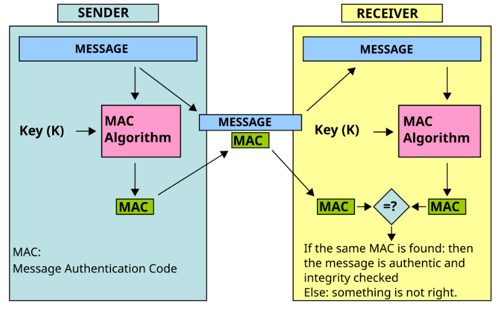
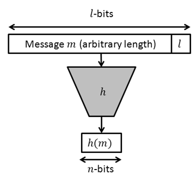

<div align="center">

[**_``Go Back``_**](../README.md)

</div>

# Message Authentication and Hash Functions

## Message Authentication

**Message authentication** is the process of verifying the integrity of a message to ensure that it has not been altered or tampered with during transmission. Message authentication is typically achieved by using **message authentication codes (MACs)**, **authenticated encryption (AE)**, or digital signatures.

> **Message authentication** or **Data origin authentication** is a property that a message has not been modified while in transit (data integrity) and that the receiving party can verify the source of the message.

### Message Authentication Code

The **Message Authentication Code**, also known as **Digital Authenticator**, is used as an integrity check based on a secret key shared by two parties to authenticate information transmitted between them.

#### Algorithm

**MAC** algorithm is a symmetric key cryptographic technique to provide message authentication. For establishing MAC process, the sender and receiver share a symmetric key ``K``.

Essentially, a **MAC** is an encrypted checksum generated on the underlying message that is sent along with a message to ensure message authentication.

The process of using **MAC** for authentication is depicted in the following illustration :



Let us now try to understand the entire process in detail :

- The ``sender`` uses some publicly known **MAC algorithm**, inputs the message and the secret key ``K`` and produces a **MAC value**.

- Similar to hash, **MAC** function also compresses an arbitrary long input into a fixed length output. The major difference between **hash** and **MAC** is that **MAC** uses secret key during the compression.

- The ``sender`` forwards the message along with the MAC. Here, we assume that the message is sent in the clear, as we are concerned of providing message origin authentication, not confidentiality. If confidentiality is required then the message needs encryption.

- On receipt of the message and the **MAC**, the receiver feeds the received message and the shared secret key ``K`` into the **MAC** algorithm and re-computes the MAC value.

- The receiver now checks equality of freshly computed MAC with the **MAC** received from the ``sender``. If they match, then the receiver accepts the message and assures himself that the message has been sent by the intended sender.

- If the computed **MAC** does not match the **MAC** sent by the ``sender``, the ``receiver`` cannot determine whether it is the message that has been altered or it is the origin that has been falsified. As a bottom-line, a receiver safely assumes that the message is not the genuine.

### Limitations of MAC
There are two major limitations of **MAC**, both due to its symmetric nature of operation :

- Establishment of Shared Secret.

    - It can provide message authentication among pre-decided legitimate users who have shared key.

    - This requires establishment of shared secret prior to use of **MAC**.

- Inability to Provide Non-Repudiation

    - Non-repudiation is the assurance that a message originator cannot deny any previously sent messages and commitments or actions.

    - **MAC** technique does not provide a non-repudiation service. If the sender and receiver get involved in a dispute over message origination, MACs cannot provide a proof that a message was indeed sent by the sender.

    - Though no third party can compute the **MAC**, still sender could deny having sent the message and claim that the receiver forged it, as it is impossible to determine which of the two parties computed the **MAC**.

## Hash Function

A hash function is a **mathematical algorithm** that takes in an input (also known as the "message") and
produces a **fixed-length output**, known as a **hash or message digest**. The main purpose of a hash function
is to ensure the **integrity of data** by verifying that it has not been **altered or corrupted** during transmission
or storage.



### Hash function Features

- **Deterministic**: Given the same input, the hash function will always produce the same output.

- **Fast**: A good hash function should be able to produce a hash value quickly, even for large amounts of data.

- **Uniformity**: A hash function should distribute its output uniformly across its range, meaning that every possible output value should have an equal probability of being produced.

- **Non-invertible**: A hash function should be difficult, if not impossible, to reverse. Given the hash value, it should be extremely difficult to determine the original input message.

- **Collision resistance**: A hash function should produce different hash values for different input messages. It should be computationally infeasible to find two different input messages that produce the same hash value.

- **Fixed length output**: A hash function should produce a fixed length output regardless of the size of the input message.

- **Sensitivity to input**: A small change in the input message should produce a significant change in the hash value.

## Message Digest: MD4 and MD5

### MD4

MD4 is a cryptographic hash function designed by **Ronald Rivest** in **1990**. It was one of the earlier hash functions in the family of message digests.

#### Algorithm Details:

- **Input**: Takes an ``arbitrary-length`` input message.

- **Output**: Produces a ``128-bit (16-byte)`` hash value, typically rendered as a ``32-character`` hexadecimal number.

- **Process**: The input message is divided into ``512-bit`` blocks, padded to ensure that its length is congruent to 448 modulo 512. The padding is followed by appending the length of the original message as a ``64-bit`` integer.

- **Rounds**: The algorithm processes each block in three rounds of operations using a combination of logical functions, bitwise operations, and modular additions.

### MD5

MD5, also designed by **Ronald Rivest**, was developed in ``1991`` as an improvement over MD4. It was widely used in the past for verifying data integrity.

#### Algorithm Details:

- **Input**: Like MD4, MD5 takes an arbitrary-length input message.

- **Output**: It produces a 128-bit (16-byte) hash value.

- **Process**: MD5 processes the input in ``512-bit`` blocks. It involves padding the message so that its length is congruent to 448 modulo 512, followed by appending the message length as a ``64-bit`` integer.

- **Rounds**: MD5 processes each block in four rounds of operations, which are more complex than those in MD4. The algorithm applies nonlinear functions, modular additions, and bitwise operations to generate the hash.

### Difference between MD4 and MD5:

- **Security**: MD4 is now considered to be insecure due to its vulnerabilities to collision attacks, whereas
MD5 is also considered less secure than newer hash functions due to its vulnerabilities to length extension
attacks.

- **Output length**: MD4 produces a 128-bit hash value, while MD5 also produces a 128-bit hash value.

- **Speed**: MD4 is faster than MD5, but this speed advantage comes at the cost of security.

- **Applications**: Both MD4 and MD5 can be used for data integrity checks, password hashing, and digital
signatures, but MD5 is more widely used and supported in practice.

## Secure Hash Algorithm : SHA-1

**SHA-1 (Secure Hash Algorithm 1)** is a cryptographic hash function that takes an input and produces a ``160-bit (20-byte)`` hash value, typically rendered as a ``40-digit`` hexadecimal number. It was designed by the **National Security Agency (NSA)** and published by the **National Institute of Standards and Technology (NIST)** in ``1993`` as a **U.S. Federal Information Processing Standard**.

While ``SHA-1`` was widely used in digital signatures, certificates, and other security protocols, its use has dramatically declined due to its weaknesses. However, it might still be encountered in legacy systems.

**Key Characteristics:**

- **Input**: SHA-1 can process input data of any size.
- **Output**: It produces a fixed-size ``160-bit (20-byte)`` hash value.
- **Deterministic**: For a given input, it always produces the same hash.
- **Pre-image Resistance**: It is computationally infeasible to reverse-engineer the original input from the hash.
- **Collision Resistance**: Originally designed to make it computationally infeasible to find two different inputs that produce the same hash value.

## HMAC

A Hash-based Message Authentication Code (HMAC) is a specific type of Message Authentication Code (MAC) that involves a cryptographic hash function combined with a secret cryptographic key. It provides data integrity and authenticity by ensuring that a message has not been altered and that it comes from a verified source.

### Key Components:
1. **Message (`m`)**: The data or message that needs to be authenticated.
2. **Secret Key (`k`)**: A secret key known only to the sender and receiver, which is used to produce the HMAC.
3. **Cryptographic Hash Function (`H`)**: A hash function, such as ``SHA-256``, ``MD5``, or ``SHA-1``, used to process the message and key.

### How HMAC Works:
HMAC works by combining the secret key with the message in a specific way and then passing the result through a hash function. The process is as follows:

1. **Padding the Key**:
   - If the key is shorter than the block size of the hash function, it's padded with zeros to make it equal to the block size.
   - If the key is longer than the block size, it's hashed and then padded to the block size.

2. **Creating Two Keys**:
   - An inner key is created by XORing the key with a block of `0x36` values.
   - An outer key is created by XORing the key with a block of `0x5C` values.

3. **Hashing Process**:
   - The inner hash is computed by concatenating the inner key with the message and passing the result through the hash function.
   - The outer hash is computed by concatenating the outer key with the result of the inner hash and passing it through the hash function again.

4. **Final HMAC Value**:
   - The output of the second hash function is the HMAC value.

### HMAC Formula:
The HMAC is computed as follows:

```
HMAC=H((k⊕opad)∥H((k⊕ipad)∥m))
```

Where:
- `k` is the secret key.
- `m` is the message.
- `H` is the cryptographic hash function.
- `opad` is the outer padding (0x5C repeated to the block size).
- `ipad` is the inner padding (0x36 repeated to the block size).
- `∥` denotes concatenation.

### Security Properties:
- **Message Integrity**: HMAC ensures that the message has not been altered. Any change to the message results in a different HMAC value.
- **Authentication**: HMAC verifies that the message was sent by someone who knows the secret key.
- **Resistance to Collisions**: Even if two different messages have the same hash value, the use of the secret key in HMAC prevents an attacker from easily forging a valid HMAC.

### Use Cases:
- **API Authentication**: HMAC is commonly used in securing API communications, where it helps in authenticating requests and responses.
- **Data Integrity Checks**: HMAC is used in protocols like TLS, IPsec, and others to ensure data integrity and authenticity.
- **Digital Signatures**: HMAC can be used as part of a digital signature scheme.

## Digital Signature

A digital signature is a mathematical technique used to ensure the authenticity, integrity, and non-repudiation of electronic documents, messages, or transactions.

### Procedures:

- **Creation of Digital Signature**: The sender creates a digital signature by using a cryptographic algorithm to generate a unique digital code based on the content of the message or document. The sender's private key is used to generate the digital signature.

- **Verification of Digital Signature**: The recipient uses the sender's public key to verify the digital signature. The recipient computes a new digital code based on the received message or document and compares it to the digital signature. If the two codes match, the digital signature is valid, and the message or document is considered authentic.

- **Non-repudiation**: Since the sender's private key is used to generate the digital signature, the sender cannot deny that they signed the document or message. This property is known as non-repudiation.

- **Integrity**: Any change made to the original message or document will result in a different digital signature, making it impossible for the recipient to verify the signature.

- **Authenticity**: The digital signature proves the identity of the sender, as only the sender's private key can be used to generate the signature.

