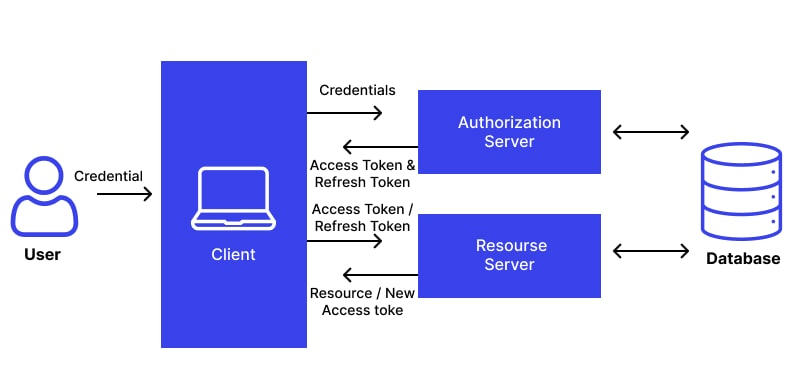

[**_``Go Back``_**](../README.md)

# User Authentication

**User authentication** is a process of verifying user identity whenever they attempt to access a system, network, account, or device. It’s a security procedure that ensures unauthorized entities wouldn’t reach sensitive data or connect to private networks. Businesses can also apply user verification methods to grant different authorization levels when employees access certain information or assets.

During the authentication process, the user is asked to provide their credentials, usually a username and password, created upon registration. In some cases, credentials can include other forms than a user-created password, such as an additional ``one-time password (OTP)`` sent to a phone or email account, a piece of biometric data, or a push notification. If the user fails to provide correct login credentials for the account or network, the authentication system blocks their access.

> Authentication is the process of identifying users that request access to a system, network, or device.

## User Authentication Principles

- **Identification & Verification**: Users identify themselves with unique identifiers (e.g., username) and verify their identity through methods like passwords or biometrics.

- **Multi-Factor Authentication (MFA) & Strong Authentication**: Use multiple and strong authentication factors (e.g., something the user knows, has, or is) to enhance security and reduce the risk of unauthorized access.

- **Least Privilege & Access Control**: Grant users the minimum access necessary to perform their tasks, and restrict resource access to only those who have successfully authenticated.

- **User Privacy, Secure Storage & Communication**: Protect user privacy by collecting minimal data, securely store credentials using encryption, and ensure all authentication communications are encrypted.

- **Continuous Monitoring, Auditability & Compliance**: Continuously monitor for threats, maintain audit logs to identify security issues, and ensure the system complies with relevant security standards and regulations.

## Password-Based Authentication

Password-based authentication is a method where users provide a username and password to verify their identity. Although widely used, it's vulnerable to attacks like password guessing, brute-force attacks, and phishing. To enhance security, best practices should be followed:

### Best Practices

- **Strong Password Policy**: Enforce complex passwords and regular changes, while avoiding password reuse.
- **Password Encryption**: Store passwords securely using hashing algorithms to prevent recovery, even by system administrators.
- **Two-Factor Authentication (2FA)**: Add an extra layer of security by requiring a second form of identification.
- **Account Lockout**: Limit incorrect login attempts to prevent brute-force attacks.
- **Regular Security Audits**: Identify vulnerabilities through audits.

### Password Selection Strategies

- **Use a Passphrase**: A long and complex sentence that is easy to remember but difficult to guess.
- **Combination of Characters**: Use a mix of upper and lower case letters, numbers, and special characters.
- **Avoid Common Words**: Avoid easily guessed or dictionary words, and use misspellings or abbreviations.
- **Use a Password Manager**: Safely store complex passwords and only remember one master password.
- **Don't Reuse Passwords**: Use a unique password for each account.
- **Change Passwords Regularly**: Change passwords every 60 to 90 days.
- **Enable Multi-Factor Authentication**: Add extra layers of security through multiple identification forms.

### Common Password Attacks

- **Brute-Force Attack**: Trying every possible character combination.
- **Dictionary Attack**: Using common words or password lists to guess the password.
- **Rainbow Table Attack**: Using precomputed hash tables to crack passwords.
- **Social Engineering**: Manipulating users to reveal their passwords.
- **Keylogging**: Recording keystrokes, including passwords.
- **Shoulder Surfing**: Observing users as they enter their passwords.

### Use of Hashed Passwords

- **Salted Hashing**: A salt is a random string added to a password before hashing to ensure that even identical passwords produce different hashes.
- **Login Process**: When users log in, the password is combined with the salt and hashed. The result is compared with the stored hash to grant access.

## Token-Based Authentication

**Token-based authentication** enhances security by using computer-generated tokens to verify users instead of relying solely on passwords. Tokens can be classified into two types:

### Types of Tokens
1. **Physical Tokens**: 
   - **Hard Tokens**: Tangible devices like smart cards or USB keys used to store user information and grant access to restricted networks.
   - **Soft Tokens**: Use mobile apps or computers to send encrypted codes (e.g., OTP via SMS or apps) to authenticate users.

2. **Web Tokens**: 
   - Fully digital tokens used in server-client interactions. A user sends credentials to the server, which generates a token (e.g., JSON Web Token, JWT) upon successful verification.

### What is Token-Based Authentication?

Token-based authentication is a two-step process used to enhance user security. After registering their credentials, users receive a unique encrypted token, valid for a specified session time. This allows users to access applications or websites without having to log in repeatedly during the session. Tokens are stateless, meaning they do not store user information in the database and are destroyed after the session ends.

### How Token-Based Authentication Works

#### 1. Request
The user attempts to access a service by providing login credentials (e.g., username, password, smart card, or biometrics).

#### 2. Verification
The client-server sends the login information to the authentication server for verification. If the credentials are valid, the server generates a token and sends it to the user. The token is typically in JSON Web Token (JWT) format, which includes:
- **Header**: Specifies the token type and signing algorithm.
- **Payload**: Contains user information and other relevant data.
- **Signature**: Verifies the authenticity of the token and its contents.

#### 3. Token Validation
The user submits the token to the resource server to gain access to the network. The token is valid for a limited time (e.g., 30–60 seconds). If expired, the user may request a **Refresh Token** to extend access. There are limits on the number of attempts to prevent brute-force attacks.

#### 4. Storage
Once the token is validated, the resource server grants access, and the token is stored for the session duration. Session times vary based on the application, with high-security apps (e.g., banking) often having shorter sessions.

#### 5. Expiration
The token will remain active until the user logs out or closes the server.

### Benefits of Token-Based Authentication
- **Security**: Tokens are encrypted and stateless, providing enhanced protection against hackers.
- **Efficiency**: Users do not need to log in repeatedly within a session.
- **Example**: One common example is OTP (One-Time Password), which verifies users and is valid for a short duration.

Token-based authentication is a widely used, secure, and efficient method for verifying user identity and providing network access.

## Biometric Authentication

Biometric authentication is a secure way of verifying identity using unique physical traits such as fingerprints, facial recognition, iris patterns, or voice recognition. As traditional passwords become more vulnerable to cyber threats, biometrics offers enhanced security due to its uniqueness and difficulty in replication.

Biometric authentication verifies identity through physical attributes like fingerprints, voice, eyes, or facial features. Unlike passwords, which can be easily guessed or stolen, biometric traits are unique to individuals, making it challenging to replicate.

### Types of Biometric Authentication

1. **Facial Recognition**: Uses facial features to identify individuals. It’s widely used in smartphones, payments, and law enforcement.
2. **Fingerprint**: Fingerprint authentication is common on phones, laptops, and buildings due to its ease of use and reliability.
3. **Eye Recognition**: Scans the iris or retina, offering high accuracy. It’s mainly used in high-security environments.
4. **Voice Recognition**: Analyzes voice tone and pattern for authentication, commonly used in customer service.
5. **Vein Recognition**: Maps vein patterns beneath the skin using infrared light, offering highly accurate authentication.

### Multimodal Biometric Authentication

Multimodal systems use multiple biometric traits to verify identity, making it harder for hackers to bypass. For example, combining facial recognition with voice authentication adds extra layers of security.

### Benefits of Biometric Authentication

1. **Identity Assurance**: Biometrics offer strong identity verification since physical traits can’t be easily forged.
2. **Ease of Use**: Users don’t need to remember complex passwords; biometrics like fingerprint scans provide quick access.
3. **Fraud Prevention**: The uniqueness of biometric data makes it nearly impossible for hackers to break into accounts.

### Risks of Biometric Authentication

1. **Hacking**: Biometric data breaches are possible, and since biometrics are immutable, they can’t be changed like passwords.
2. **Partial Matches**: Some systems use only parts of biometric data, which may reduce accuracy.
3. **Failed Recognition**: Changes in appearance can cause systems to fail in recognizing users.
4. **Bias**: Some biometric systems have difficulty recognizing certain groups due to biased training data.
5. **Privacy Concerns**: Biometric data might be shared with governments or other entities without user consent.
6. **Data Storage**: Biometric data needs secure storage since it cannot be replaced once compromised.

### Passwords vs. Biometrics

While passwords can be easily hacked through methods like phishing, biometric authentication offers stronger protection as it relies on unique physical traits. Additionally, biometric systems can be paired with multi-factor authentication for even more robust security.

### Biometric Authentication Myths Busted

1. **Myth**: Biometrics are easy to fake.  
   **Reality**: Advanced systems can detect spoofing attempts with technologies like infrared scans.
   
2. **Myth**: Biometric systems are perfect.  
   **Reality**: Biometric systems can sometimes fail due to changes in appearance or environmental factors.
   
3. **Myth**: Biometric data can be easily stolen.  
   **Reality**: Biometric data is highly encrypted, making it difficult to reverse-engineer.
   
4. **Myth**: Biometric authentication is expensive.  
   **Reality**: The cost of biometric systems has decreased, making them accessible for small businesses and individuals.

### Biometric Authentication Use Cases

1. **Healthcare**: Used to accurately identify patients and protect medical records.
2. **Travel**: E-passports contain biometric data like fingerprints and facial recognition for secure identification.
3. **Law Enforcement**: Biometric data such as fingerprints and DNA is used to identify suspects and solve crimes.

## Remote User Authentication

**Remote authentication** is a key aspect of cybersecurity that verifies a user's identity when accessing systems or networks from a distance. This process ensures that only authorized individuals gain entry while preventing potential security threats. As technology evolves and cyberattacks become more sophisticated, traditional authentication methods are being re-evaluated, prompting organizations to enhance their defenses.

### Defining Remote Authentication
Remote authentication confirms user identity for secure access to a system or network from a remote location. It relies on security protocols to protect against unauthorized access.

### Types and Techniques of Remote Authentication

Remote authentication employs various methods and techniques to verify users’ identities:

- **Password-based Authentication**: This is the most basic method, requiring a username and password. However, it's vulnerable to brute force, phishing, and other types of attacks.
- **Biometric Authentication**: Involves verifying unique user traits like fingerprints, facial recognition, or iris scans. Biometric methods are harder to forge, making them more secure.
- **Multi-Factor Authentication (MFA)**: Combines two or more authentication factors (e.g., something you know—password, something you have—security token, and something you are—biometrics). MFA adds an extra layer of protection, reducing the risks associated with stolen credentials.

### Importance and Applications of Remote Authentication
Remote authentication safeguards sensitive data and maintains system integrity. Techniques like two-factor authentication reduce the risk of unauthorized access and data breaches by requiring additional user verification.

## Two Factor Authentication

**Two-factor authentication (2FA)** is an additional layer of security used to ensure that individuals trying to access an online account are who they claim to be. It requires two types of identification from the user: something they know (like a password) and something they have (like a phone or security token). This extra step significantly reduces the likelihood of unauthorized access, even if an attacker obtains a user's password.

### How 2FA Works:
1. **First Factor** – The user enters their **username and password**, which is the standard method for accessing an account.
2. **Second Factor** – After the initial login, the user must provide another piece of evidence to confirm their identity. This second factor is typically one of the following:
   - **Something you have**: A temporary code sent via SMS, an authentication app, or a hardware token.
   - **Something you are**: Biometric verification, like a fingerprint or facial recognition.
   
### Common Types of Second Factors:
- **SMS codes**: A one-time code sent via text message.
- **Authentication apps**: Apps like Google Authenticator or Microsoft Authenticator generate a time-based code.
- **Email verification**: A code or link sent to the user's email.
- **Hardware tokens**: Physical devices that generate security codes.
- **Biometrics**: Fingerprint scans, facial recognition, or voice recognition.

### Importance of 2FA:
2FA adds an essential layer of security, preventing unauthorized access even if the user's password is compromised. It mitigates risks from phishing, keylogging, and brute force attacks, making it much harder for attackers to breach systems.

### Benefits of Two-Factor Authentication:
- **Enhanced security**: Provides extra protection by requiring more than just a password.
- **Mitigates password weaknesses**: Even if passwords are weak or stolen, the second factor prevents unauthorized access.
- **Improved user trust**: Users feel more confident knowing that their accounts are more secure.

### Applications:
2FA is widely used across industries, particularly for online banking, email services, social media, and corporate systems, providing stronger protection for personal data and sensitive information.