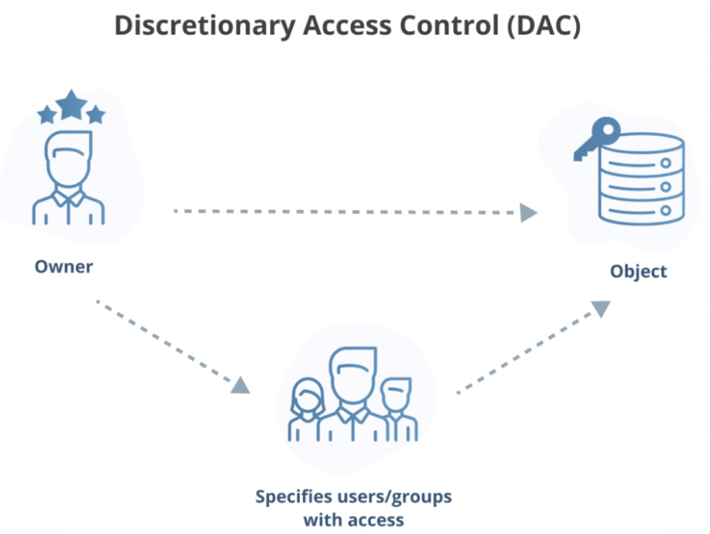

[**_``Go Back``_**](../README.md)

# Access Control

Access control is a vital part of information security and is defined as the process by which you grant or deny access to your data, property, and other objects. Three elements make up access control: identification, authentication, and authorization.  It consists of three key elements:

- **Identification**: Verifies the user’s identity through user IDs or physical badges.
- **Authentication**: Confirms the user's identity using methods like passwords or biometrics (e.g., fingerprints).
- **Authorization**: Determines what resources users can access based on discretionary (assigned by administrators) or mandatory rules.

**Challenges in Access Control**

Organizations face the following challenges while implementing access control systems:

- **Balancing Security and Usability**: Strong security measures can hinder productivity, so a balance is required between security and user experience.
- **Managing Complexity**: Maintaining access policies across different systems and users is complex and needs regular updates and automation.
- **Addressing New Threats**: Organizations must constantly adapt to evolving threats like phishing or credential attacks, implementing advanced techniques like behavioral analytics.

## Access Control Principles

- **Principle of Least Privilege**: States that if nothing has been specifically configured for an individual or the groups, he/she belongs to, the user should not be able to access that resource i.e. Default no access.

- **Separation of Duties**: Separating any conflicting areas of responsibility so as to reduce opportunities for unauthorized or unintentional modification or misuse of organizational assets and/or information.

- **Need to know**: It is based on the concept that individuals should be given access only to the information that they absolutely require in order to perform their job duties.

## Subjects, Objects and Access Rights

In access control, three key elements are involved: subjects, objects, and access rights.

- **Subject**: An entity (e.g., user, process) that accesses objects. Subjects act on behalf of users and are accountable for their actions. There are three main types of subjects:

    - ``Owner``: The creator or administrator of a resource.
    - ``Group``: A set of users with shared access rights.
    - ``World``: All users not categorized as owners or group members, typically with limited access.

- **Object**: A resource (e.g., files, records, directories) that stores or receives information, controlled by access rights.

- **Access Rights**: Define how subjects can interact with objects. Common rights include:

    - ``Read``: View or copy data.
    - ``Write``: Modify or delete data.
    - ``Execute``: Run programs.
    - ``Delete``: Remove resources.
    - ``Create``: Add new resources.
    - ``Search``: Browse directories or resources

## Access Control Matrix and Capability Lists

The **Access Control Matrix** and **Capability Lists** are key mechanisms used to implement access control in computing systems.

### Access Control Matrix (ACM):

- ``Definition``: It is a conceptual table that defines the access rights of subjects (users, processes) to objects (files, databases, devices) in a system.
- ``Structure``: The matrix consists of rows representing subjects and columns representing objects. Each cell contains the access rights (like read, write, execute) that the subject has for the object.
- ``Example``: If a row represents a user and a column represents a file, the cell at their intersection might specify that the user can read and write the file.

    |            | File 1 | File 2 | Printer |
    |------------|--------|--------|---------|
    | **User A** | Read   | Write  | Execute |
    | **User B** | None   | Read   | None    |

### Capability Lists:
- ``Definition``: A capability list is a more practical implementation of access control, representing what objects a particular subject has the right to access and what operations they can perform.
- ``Structure``: Instead of having a full matrix, each subject has its own list of capabilities, specifying what objects it can access and with what rights.
- ``Example``: A user might have a capability list stating that they can ``"read File 1"``, ``"write to File 2"`` and ``"execute Printer"``.

## Discretionary Access Control (DAC)

**Discretionary Access Control (DAC)** is a decentralized access control policy that allows subjects (users or groups) to control access to objects (data or resources). It is widely implemented in various systems such as smartphone apps, Google Docs, and operating systems.

### How DAC Works:

DAC relies on subject identification and authentication to grant access to objects. Once authenticated, the system determines if the user has the required access rights to a specific object.

Key Components:

- ``Subjects``: Users or groups seeking access to protected resources.
- ``Objects``: System resources such as applications, files, or data.

### Types of DAC Systems:

- **Access Control Lists (ACLs)**: A list that defines which users have access to specific objects and what operations they are allowed to perform (e.g., read, write). It can be tied to role-based systems.

- **Capability Systems**: Access is granted based on possession of specific credentials (e.g., a private key in cryptocurrencies or a hidden URL for accessing images on Imgur).

### Benefits of Discretionary Access Control (DAC)

- **Flexibility**: DAC allows object owners to set permissions for each object individually. Users can create groups and apply fine-grained control over access, which isn't possible with mandatory access control (MAC) systems.

- **Speed and Efficiency**: DAC enables information to flow freely through networks. Users can grant access with a click, eliminating the need for complex user profiles or clearance levels.

- **Low Administrative Burden**: Access management is decentralized, so object owners control access rather than administrators managing profiles for every user.

- **Simple Policy Management**: Administrators only need to assign privileges, and DAC becomes easy to manage with the right access control list (ACL) tools.

### Challenges of Discretionary Access Control (DAC)
 
- **Security Risks**: DAC is generally less secure than MAC. Users may unintentionally expose access points to attacks like malware or privilege creep, allowing unauthorized access.

- **Lack of Visibility**: The decentralized nature can result in confusion, making it difficult for security teams to track access and leading to security gaps.

- **Maintenance**: Object owners must maintain ACLs. Over time, ACLs can become outdated, granting access to former employees or failing to reflect changes in user roles.

- **Poor Data Protection**: For highly sensitive data (e.g., health or financial), centralized controls are recommended. DAC does not provide sufficient security assurance for protecting critical data.

### Examples of Discretionary Access Control (DAC)

- **Social Media**: Facebook groups use DAC by allowing group owners to control access to content. Members have limited ability to share or transfer content.

- **Smartphone Apps**: DAC allows users to grant specific permissions (e.g., GPS access) to different apps.

- **File System Management**: Operating systems like UNIX, Windows, and DOS use DAC for setting file read, write, and execute privileges.

- **Collaboration Platforms**: Tools like Google Docs or Dropbox allow users to set specific access controls (view, edit) for different collaborators.

- **Crypto Wallets**: Access is granted to users who possess the private key, allowing them to transfer assets securely.

- **Scripts**: Script execution, such as those used in MS Excel, can be limited using DAC, though insecure scripts may lead to vulnerabilities.

### Discretionary Access Control (DAC) vs. Mandatory Access Control (MAC)

| **Feature**                     | **MAC (Mandatory Access Control)**              | **DAC (Discretionary Access Control)**        |
|---------------------------------|-------------------------------------------------|-----------------------------------------------|
| **Access Control Enforced by**  | Administrators and operating system             | Administrators and users                      |
| **Access Control Policy**       | Confidentiality levels and clearances           | Access-control lists with user identities     |
| **Maintenance**                 | Hard                                            | Easy                                          |
| **Implementation Cost**         | High                                            | Low                                           |
| **Granularity**                 | Admins adjust clearance manually                | Users assign access rights                    |
| **Security Level**              | High                                            | Low                                           |
| **Trusted Users**               | Only administrators                            | All users                                     |

**Use Cases:**

- **MAC**: Ideal for environments where security and confidentiality are paramount, such as **government agencies** and **military organizations**.
- **DAC**: Offers **flexibility** and **customization**, making it a great fit for everyday use cases like **smartphone apps**, **social media platforms**, and **file management systems**.

## Role-Based Access Control (RBAC)

**Role-Based Access Control (RBAC)** is a widely used access control method that restricts system access to authorized users based on their role within an organization. Instead of assigning permissions directly to individual users, permissions are assigned to roles, and users are then assigned to roles, streamlining the management of access rights.

### Key Components of RBAC:

1. **Roles**: A role represents a specific job function or responsibility within the organization, such as *Administrator*, *Manager*, or *Employee*. Roles have specific permissions assigned to them.

2. **Permissions**: These are the privileges or operations that can be performed on system resources, such as *read*, *write*, *delete*, or *execute*.

3. **Users**: Users are individuals who are assigned roles based on their responsibilities. Their access to resources is determined by the role(s) they are assigned.

4. **Role Assignments**: Users are assigned roles that define their permissions. For example, a user in the *Admin* role may have access to all system functions, while a user in the *Employee* role may only have access to specific tasks.

5. **Resources**: These are the objects or systems that users need to access, such as files, databases, or applications.

6. **Constraints**: In some RBAC implementations, constraints can be applied, such as **Separation of Duties (SoD)**, where conflicting roles (like a user being both an *auditor* and a *finance officer*) are not permitted for a single user.

### Benefits of RBAC:

- **Scalability**: RBAC is ideal for large organizations where managing individual permissions for hundreds or thousands of users would be too complex.
  
- **Reduced Administrative Overhead**: Roles simplify permission management, as administrators only need to define permissions for roles, not individual users.
  
- **Security**: By enforcing the principle of least privilege, users only have access to the resources they need to perform their job functions.
  
- **Auditability**: RBAC systems provide a clear mapping of user roles and their corresponding access permissions, making it easier to track access rights and perform security audits.

### RBAC Use Cases:

- **Healthcare**: Doctors, nurses, and administrative staff are assigned different roles with different permissions to access patient records and medical systems.

- **Enterprise IT Systems**: RBAC is used to manage access to critical resources, such as databases, systems, and applications, ensuring that only authorized personnel can access sensitive information.

- **Cloud Platforms**: Services like AWS, Azure, and Google Cloud Platform allow administrators to assign roles like *Developer*, *Admin*, or *Viewer* to users, controlling access to cloud resources.

### RBAC vs. Other Access Control Models:

- **RBAC vs. DAC (Discretionary Access Control)**: In DAC, individual users control access to resources they own, while RBAC assigns permissions based on roles, which are centrally managed.
  
- **RBAC vs. MAC (Mandatory Access Control)**: MAC is enforced by security policies and is often used in highly sensitive environments like military systems. RBAC, on the other hand, focuses on job roles and is more flexible for business use.

### Example of RBAC:

| Role            | Permissions                                    |
|-----------------|------------------------------------------------|
| **Admin**       | ``Read``, ``Write``, ``Delete``, ``Configure`` |
| **Manager**     | ``Read``, ``Write``, ``Approve``               |
| **Employee**    | ``Read``, ``Submit Requests``                  |

In this example, **Admins** have full control over the system, **Managers** can modify and approve requests, and **Employees** can only read and submit new requests.

RBAC ensures that each user can only access the resources necessary for their role, maintaining a secure and well-structured access control system.

## Attribute Based Access Control

**Attribute-Based Access Control (ABAC)** is an authorization model that evaluates attributes (characteristics) rather than roles to determine access to resources, ensuring protection from unauthorized actions based on security policies.

### Main Components:

- **Subject**: The user requesting access, defined by attributes such as ID, job role, security clearance.
- **Resource**: The object being accessed (e.g., files, servers), defined by attributes like creation date, type, and sensitivity.
- **Action**: What the subject wants to do (e.g., read, write, edit).
- **Environment**: The broader context of the access request (e.g., time, location, device).

### How ABAC Works:

- Policies define access based on attribute combinations.
- For example, if a subject’s job role matches a policy, they can access relevant resources.
- This approach allows for granular, policy-driven access control that can scale with various combinations of attributes.

### Benefits of ABAC:

- **Granular, Flexible Policy-Making**: Access is based on attributes, making it adaptable to many situations with less manual oversight.
- **Compatibility with New Users**: New users can access resources without needing role-specific adjustments.
- **Enhanced Security and Privacy**: Contextual variables (e.g., time, location) improve security and privacy by enforcing fine-grained controls.

### Drawbacks:

-  **Complexity**: ABAC can be difficult to design and implement, as admins must define attributes, assign them to components, and create policies from scratch. However, once set up, it becomes easier to manage.

### Choosing the Right Model:

- ``ABAC`` is suited for larger organizations needing deep, specific access controls, privacy, and security compliance.
- ``RBAC`` is better for small- to medium-sized businesses with well-defined roles and simpler access needs.

## Identity, Credential, and Access Management (ICAM)

**Identity, Credential, and Access Management (ICAM)** is a framework of policies, technologies, and programs used to create, manage, and control digital identities, credentials, and access to protect an organization's assets and systems. ICAM helps organizations, including government agencies and private sector companies, ensure that only authorized users access sensitive information at the right time for the right purpose, reducing the risk of cyber attacks.

### Key Aspects of ICAM:

- **Identity Management**: Processes and technologies used to identify, authenticate, and manage user identities, devices, or procedures when accessing a system.
- **Credential Management**: Creation and lifecycle management of credentials (e.g., passwords, tokens, biometrics) used for user authentication.
- **Access Management**: Controls and manages user access to networks, systems, and data based on their authentication and role.

### Benefits of ICAM:

- **Improved Security**: Minimizes data breaches by implementing identity-centric security measures.
- **Cost Reduction**: Automates identity and access management tasks, reducing manual overhead.
- **Scalability**: Supports compliance and agility through modern platforms and automation.
- **Visibility & Auditing**: Tracks and audits access activities to identify potential security issues.
- **Risk Management**: Uses analytics to make informed, risk-based access decisions.

### Key Features:

- **Single Sign-On (SSO)**: Simplifies user login across multiple systems with one set of credentials.
- **Multi-Factor Authentication (MFA)**: Adds extra security layers by requiring two or more verification factors.
- **Lifecycle Management**: Manages digital identities from creation to deletion, ensuring access rights are updated as roles change.
- **Provisioning & Deprovisioning**: Automates the process of granting or revoking user access as employees join or leave.

``ICAM``supports zero-trust security models, where trust is never assumed and must always be verified, enhancing organizational security and efficiency

## Trust Frameworks

Trust Frameworks are sets of policies, standards, and agreements that establish trust between different entities, typically in the context of digital identity management, authentication, and access control. These frameworks ensure that all parties involved can rely on the identity, credentials, and actions of each other, facilitating secure interactions and transactions.

### Key Components of a Trust Framework:
1. **Policies and Governance**: Rules and regulations that define how identities, credentials, and access should be managed. This includes data privacy policies, compliance with legal standards (like GDPR or HIPAA), and security practices.
  
2. **Standards and Protocols**: Technical standards that ensure interoperability across systems. Common standards include protocols like OAuth, OpenID Connect, and SAML for identity authentication and authorization.
  
3. **Accreditation and Certification**: Ensures that entities (e.g., service providers, identity issuers) are certified to follow the established policies and meet security standards.

4. **Risk Management**: Defines processes for assessing, mitigating, and managing risks related to identity management and access control, helping maintain security and trust across systems.

5. **Roles and Responsibilities**: Clarifies the roles of all stakeholders involved, such as users, identity providers, and relying parties (service providers), ensuring each knows its responsibilities within the framework.

### Benefits of Trust Frameworks:
- **Interoperability**: Enables different organizations, systems, or sectors to work together securely by following common standards and practices.
- **Security**: Reduces the risk of unauthorized access, fraud, and data breaches by ensuring that all entities meet rigorous security criteria.
- **User Confidence**: Builds trust among users, ensuring their data and identities are handled securely and in compliance with regulations.
- **Compliance**: Ensures adherence to local and international regulatory requirements, streamlining processes across different legal jurisdictions.

### Examples of Trust Frameworks:
1. **National Strategy for Trusted Identities in Cyberspace (NSTIC)**: A U.S. government initiative designed to promote secure online identities.
2. **eIDAS (Electronic Identification, Authentication, and Trust Services)**: An EU regulation that establishes trust services for electronic transactions within the EU.
3. **Kantara Initiative**: An organization developing trust frameworks that support digital identity management and privacy-respecting technologies.
  
### Trust Frameworks in Practice:
Trust frameworks are commonly used in sectors like government, finance, and healthcare, where secure and compliant identity management is crucial. They form the foundation for systems like federated identity management, allowing users to access services across multiple platforms using a single verified identity, improving security and user experience.
