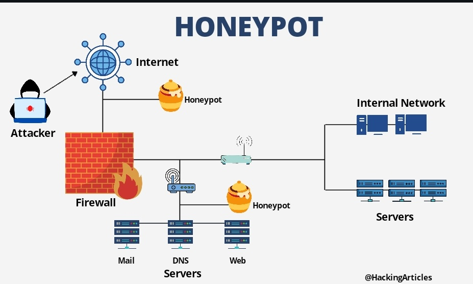

<div align="center">

[**_``Go Back``_**](../README.md)

</div>

# Malicious Soffware and Intrusion

## Malicious Software

Malicious software (malware) poses significant threats to computer systems by compromising the confidentiality, integrity, or availability of data and disrupting operations. Malware can target applications, utilities, and kernel-level programs, and is often used on compromised websites, spam emails, or through social engineering attacks to trick users into revealing sensitive information.

### Types of Malware

- **Advanced Persistent Threat (APT):** State-sponsored, persistent cyberattacks targeting businesses and political entities using various intrusion technologies.
- **Adware:** Software with embedded advertising, leading to pop-up ads or browser redirection.
- **Attack kit:** Tools that generate new malware automatically.
- **Auto-rooter:** Tools used to remotely break into systems.
- **Backdoor (trapdoor):** Mechanisms that bypass security checks, granting unauthorized access.
- **Downloaders:** Code that installs other malware onto compromised systems.
- **Drive-by-download:** Exploits browser vulnerabilities to attack clients via compromised websites.
- **Exploits:** Code targeting specific vulnerabilities.
- **Flooders (DoS client):** Used for denial-of-service (DoS) attacks by overwhelming systems with data.
- **Keyloggers:** Captures keystrokes on a compromised system.
- **Logic bomb:** Code that activates upon specific conditions being met.
- **Macro virus:** Malware embedded in documents via macros.
- **Mobile code:** Software that runs across platforms without modification.
- **Rootkit:** Tools used after gaining root access to a system.
- **Spammer programs:** Used to send mass unwanted emails.
- **Spyware:** Collects and transmits data from a system.
- **Trojan horse:** A seemingly legitimate program with hidden malicious functionality.
- **Virus:** Replicates by infecting other code.
- **Worm:** Self-propagating malware that spreads across networks.
- **Zombie/Bot:** Infected machines that can be remotely controlled for attacks.

## Virus and its phases, Virus Classification

A **virus** is a type of malicious software (malware) that, when executed, tries to replicate itself by infecting other executable code or files. It typically spreads through a host system and can cause damage by modifying, deleting, or corrupting files. A virus requires a host program to attach itself to and propagate, unlike worms that are self-replicating.

### Phases of a Virus

A virus generally passes through the following phases during its lifecycle:

1. **Dormant Phase:**
   - The virus is idle and does not actively infect or cause damage. It remains hidden, waiting to be triggered by some event (e.g., a specific date, the execution of a program, or user action).
   - Not all viruses have a dormant phase.

2. **Propagation Phase:**
   - The virus starts replicating itself by copying its code into other programs, files, or boot sectors. This may involve infecting executables, documents, or system resources.
   - In this phase, the virus ensures that it spreads to as many hosts as possible.

3. **Triggering Phase:**
   - The virus remains inactive until a specific condition or event occurs, such as a user opening an infected file, a specific system event, or a particular date. 
   - Once triggered, the virus moves into the execution phase.

4. **Execution Phase:**
   - The virus payload is executed, and it performs the malicious actions for which it was designed, such as file corruption, data theft, or system damage.

### Virus Classification

Viruses are classified based on various characteristics, such as their target, method of infection, and behavior. The main classifications are as follows:

#### 1. **Based on Target:**
   - **File Infector Viruses:**
     - Infect executable files (e.g., `.exe`, `.com`) by attaching themselves to the code.
     - The virus gets executed when the infected file is opened or run.
   - **Boot Sector Viruses:**
     - Infect the boot sector or master boot record (MBR) of a storage device like a hard disk or USB drive.
     - The virus executes during system startup and can prevent the system from booting.
   - **Macro Viruses:**
     - Infect files that contain macros, typically targeting office files such as Microsoft Word or Excel documents.
     - They execute when the document is opened or edited.
   - **Multipartite Viruses:**
     - Combine features of both file and boot sector viruses, enabling them to infect multiple parts of a system.
     - They can spread in multiple ways, such as infecting both boot sectors and executable files.

#### 2. **Based on Behavior:**
   - **Polymorphic Viruses:**
     - Modify their code with each infection, making it difficult for traditional antivirus programs to detect them.
     - The virus changes its appearance but retains its original functionality.
   - **Metamorphic Viruses:**
     - Rewrite their code entirely with each new infection, making detection even more challenging.
     - These viruses may avoid signature-based detection by changing their structure frequently.
   - **Stealth Viruses:**
     - Use various techniques to avoid detection, such as intercepting antivirus queries or hiding changes to files and system resources.
   - **Armored Viruses:**
     - Designed to make reverse-engineering and detection difficult by adding layers of obfuscation and encryption.
     - The goal is to complicate analysis and prevent antivirus software from understanding the virus’s behavior.
   
#### 3. **Based on Payload:**
   - **Non-Resident Viruses:**
     - These viruses immediately infect target files upon execution and do not stay in memory. Once they perform their task, they terminate.
   - **Resident Viruses:**
     - These viruses load themselves into memory and remain active even after the initial infected program is terminated, allowing them to infect other files during normal system operation.

#### 4. **Based on Propagation Method:**
   - **Companion Viruses:**
     - Create a file with the same name as a legitimate program but with a different extension, such as `.com` instead of `.exe`. When the user tries to open the legitimate program, the virus is executed instead.
   - **Email Viruses:**
     - Spread through infected email attachments or by exploiting vulnerabilities in email clients.
     - Once executed, the virus can replicate by sending itself to the victim's contact list.
   - **Network Viruses:**
     - Spread through network connections, often exploiting security vulnerabilities in network protocols or applications to infect connected devices.

#### 5. **Other Classifications:**
   - **Tunneling Viruses:**
     - Use techniques to avoid antivirus detection by intercepting system calls and bypassing normal security checks.
   - **Cavity (Spacefiller) Viruses:**
     - These viruses fill empty spaces within files, minimizing the damage to the file size and avoiding detection.
   - **Direct Action Viruses:**
     - Execute immediately and infect specific files upon execution but do not remain in memory afterward.

#### 6. **Hybrid Viruses:**
   - Some viruses exhibit characteristics from multiple categories, making them harder to detect and eliminate. For example, a virus can be both polymorphic and stealthy.

## Worm, Worm propagation Model, State of Worm Technology

A **worm** is a type of malware that can self-replicate and spread to other computers without needing to attach itself to a host program, unlike viruses. Worms primarily exploit software vulnerabilities or use social engineering techniques to propagate across networks, often consuming system resources and network bandwidth, which can lead to system slowdowns or crashes.

### Characteristics of a Worm

- **Self-replication**: Worms do not need a host file or program to spread. They are standalone malware programs.
- **Network Propagation**: Worms often exploit vulnerabilities in network protocols, services, or applications to propagate themselves to other machines over a network.
- **Payload**: Worms may carry harmful payloads that can delete files, encrypt data (ransomware), or install other malicious software.
- **Stealth**: Worms can often avoid detection by security systems and replicate quickly before they are neutralized.

### Worm Propagation Model

A well-designed worm can spread rapidly and infect massive numbers of hosts. To understand this behavior, we can look to classic epidemic models, which describe self-replication and propagation behavior similar to biological viruses.

#### Epidemic Model for Worm Propagation

A simplified epidemic model is expressed as:

```
dI(t)dt = β I(t) S(t)
```

Where:
- **I(t)** = Number of infected individuals (or computers) at time t.
- **S(t)** = Number of susceptible individuals (computers vulnerable but not yet infected) at time t.
- **β** = Infection rate.
- **N** = Total population size, where (N = I(t) + S(t)).

#### Dynamics of Worm Propagation

Worm propagation can be divided into three distinct phases:

1. **Exponential Growth Phase**:
   - During this initial phase, the worm spreads exponentially. For example, a worm launched from a single host infects two nearby hosts, and each of these hosts infects two more. This results in an exponential increase in infected hosts.
   
2. **Linear Growth Phase**:
   - As the number of infected hosts increases, the worm starts wasting time attacking already-infected hosts, slowing the rate of infection. In this middle phase, the growth is approximately linear, although still rapid.
   
3. **Slow Finish Phase**:
   - Once most vulnerable systems have been infected, the worm faces difficulty in finding the few remaining hosts, and propagation slows down significantly.

The objective of worm countermeasures is to detect and neutralize the worm during its slow start phase, before it can infect a large number of hosts.

#### Propagation Example

Consider a simplified scenario where a worm starts with one host, and each infected host infects two more:

- Time 1: 1 host infects 2 new hosts (total infected: 3).
- Time 2: Each of the 3 hosts infects 2 more (total infected: 9).
- Time 3: Each of the 9 hosts infects 2 more (total infected: 27).
- This results in exponential growth until saturation of vulnerable systems.

#### State of Worm Technology

The following innovations represent the state of the art in worm technology:

- **Multiplatform**: Worms can now infect a wide range of platforms, including Windows, Unix, Linux, and even mobile devices. They exploit macro and scripting languages in common document types (e.g., Word, PDF).
  
- **Multi-exploit**: Newer worms use multiple attack vectors to penetrate systems, targeting web servers, browsers, email clients, file-sharing networks, and shared media.

- **Ultrafast Spreading**: Advanced worms exploit optimization techniques to spread as quickly as possible, maximizing the number of vulnerable machines they can infect in a short time.

- **Polymorphic**: Worms adopt polymorphic techniques to evade detection. Each copy of the worm generates new code with functionally equivalent instructions or encryption, making it harder to identify through traditional signature-based methods.

- **Metamorphic**: Metamorphic worms not only change their appearance but also alter their behavior at different stages of propagation to evade detection.

- **Transport Vehicles**: Worms are commonly used as transport vehicles for various malicious payloads, including:
  - **Distributed Denial of Service (DDoS) bots**
  - **Rootkits**
  - **Spam email generators**
  - **Spyware**

- **Zero-Day Exploit**: Some worms exploit zero-day vulnerabilities, which are unknown to the broader community until the worm is launched. These exploits provide maximum surprise and distribution. In 2015, 54 zero-day exploits were discovered, many targeting widely used software, libraries, and even industrial control systems.

## Trojan Horse

A **Trojan horse** is a type of malicious software that disguises itself as legitimate software to deceive users. Unlike worms and viruses, which replicate and spread automatically, a Trojan horse relies on the user to execute it. Once activated, it can cause harm or compromise the security of the system.

### Key Characteristics of a Trojan Horse:

- **Deceptive Appearance**: 
  - A Trojan horse appears to be a useful or legitimate program, such as a game, utility, or even a software update. Users are tricked into downloading and executing it, believing it is harmless or beneficial.

- **Malicious Intent**: 
  - Despite its outwardly benign appearance, the Trojan horse contains hidden malicious functionality designed to harm the user’s system, steal sensitive information, or allow unauthorized access.

- **Does Not Self-Replicate**: 
  - Unlike viruses and worms, a Trojan horse does not replicate or spread on its own. It requires human intervention to initiate the infection, typically through downloading or opening an attachment.

- **Exploiting Legitimate Privileges**: 
  - Trojans often take advantage of legitimate system permissions or security privileges to bypass defenses. Once installed, they may perform actions like installing additional malware, stealing data, or creating backdoors for remote access.

### Common Types of Trojan Horses:

1. **Backdoor Trojan**: 
   - Opens a backdoor in the infected system, allowing remote access to the attacker. The attacker can control the system, steal data, or install other malicious software.

2. **Downloader Trojan**: 
   - Designed to download and install other types of malware, such as ransomware, adware, or spyware, onto the infected machine.

3. **Rootkit Trojan**: 
   - Hides the presence of other malicious software or activities on the infected system, making it difficult for users or security software to detect the infection.

4. **Banking Trojan**: 
   - Targets online banking activities to steal sensitive financial information, such as login credentials, credit card details, or other personal data.

5. **Spyware Trojan**: 
   - Monitors the infected system, capturing sensitive data such as keystrokes, screenshots, or browsing activity, and transmits it to the attacker.

6. **DDoS Trojan**: 
   - Converts the infected machine into part of a botnet, which can be used to launch Distributed Denial of Service (DDoS) attacks on targeted systems by flooding them with traffic.

### How Trojan Horses Spread:

Trojan horses are typically spread through:

- **Email Attachments**: Users receive an email with an attachment or link that appears legitimate, but executing it installs the Trojan.
- **Malicious Websites**: Websites may trick users into downloading a Trojan by masquerading as legitimate software downloads.
- **Software Bundles**: Some Trojans are bundled with legitimate software, especially in freeware or shareware downloads.
- **Social Engineering**: Attackers often use social engineering techniques to convince users to install the Trojan by disguising it as something desirable.

### Prevention:

To prevent infection by Trojan horses, follow these practices:

- **Do not open suspicious email attachments or click on unverified links.**
- **Download software only from trusted sources.**
- **Use updated antivirus and antimalware software.**
- **Regularly update operating systems and applications to patch vulnerabilities.**

## Intrusion and Intruders

**Intrusion** refers to unauthorized access or attempts to access a system, network, or data in order to disrupt, steal, or manipulate the information. Intruders can bypass security mechanisms and enter a system without proper authorization, often with malicious intent.

### Types of Intrusion:
- **System Intrusion**: Gaining unauthorized access to a computer system.
- **Network Intrusion**: Unauthorized access to a network to disrupt its services or steal data.
- **Physical Intrusion**: Physical access to hardware or infrastructure to compromise systems or networks.

### Intruders:
Intruders, often referred to as hackers, can be categorized based on their motivation, methods, and the type of systems they target.

#### Categories of Intruders:

1. **Masqueraders**:
   - External users who do not have authorized access to the system.
   - They impersonate a legitimate user by stealing login credentials or exploiting vulnerabilities.
   
2. **Misfeasors**:
   - Legitimate users who abuse their access privileges.
   - They may misuse their access to perform unauthorized actions, such as altering or stealing data.

3. **Clandestine Users**:
   - Individuals who seize administrative privileges and bypass normal security controls.
   - These intruders can cover their tracks by disabling or altering system logs to hide their activities.

#### Intruder Categories Based on Expertise:

1. **Script Kiddies**:
   - Inexperienced attackers who use pre-written scripts or tools to exploit vulnerabilities.
   - They lack the technical knowledge to create their own attacks but can still cause damage by using available hacking software.

2. **Skilled Hackers**:
   - Individuals with significant technical expertise who can create custom tools and develop new techniques for compromising systems.
   - They can exploit zero-day vulnerabilities and are more sophisticated in their methods.

3. **Insiders**:
   - Employees, contractors, or other individuals with authorized access who misuse their privileges to cause harm.
   - Insider threats are particularly dangerous as these individuals may have detailed knowledge of the system and its vulnerabilities.

### Methods of Intrusion:

1. **Password Cracking**:
   - Attackers use techniques like brute force, dictionary attacks, or phishing to obtain user passwords.
   
2. **Social Engineering**:
   - Manipulating users into divulging confidential information or performing actions that compromise system security.
   
3. **Exploiting Software Vulnerabilities**:
   - Taking advantage of weaknesses in software to gain unauthorized access or perform malicious activities.
   
4. **Malware**:
   - Intruders use malware (viruses, worms, trojans, etc.) to gain control over a system, steal data, or disrupt operations.

5. **Denial of Service (DoS) Attacks**:
   - Overloading a system with traffic to disrupt its availability to legitimate users, causing service downtime or failure.

## Intrusion Detection Systems:

**Intrusion Detection Systems (IDS)** are used to detect unauthorized access and alert system administrators. There are two main types of IDS:

1. **Host-Based IDS (HIDS)**:
   - Monitors activities on individual devices or systems.
   - HIDS detect unusual or malicious activities on a host machine, such as changes to system files, registry settings, or login attempts.

2. **Network-Based IDS (NIDS)**:
   - Monitors network traffic for signs of intrusion.
   - NIDS look for suspicious patterns, such as unusual packet flows, known attack signatures, or unauthorized attempts to access the network.

### Countermeasures Against Intrusions:

1. **Access Controls**:
   - Implement strong authentication mechanisms, such as multifactor authentication (MFA), to restrict access to authorized users.

2. **Encryption**:
   - Encrypt sensitive data both in transit and at rest to prevent unauthorized access.

3. **Patch Management**:
   - Regularly update software and apply security patches to close vulnerabilities that intruders might exploit.

4. **User Education**:
   - Train users to recognize social engineering attacks, phishing emails, and other methods used by intruders.

5. **Intrusion Prevention Systems (IPS)**:
   - IPS systems are designed to detect and prevent malicious activities in real-time by blocking attacks before they compromise the system.

## Analysis Approaches: Anomaly-Based and Signature-Based

When it comes to detecting intrusions and malicious activities in systems and networks, two primary analysis approaches are commonly used: **Anomaly-Based** detection and **Signature-Based** detection. Both have their strengths and weaknesses, and are often used together to provide comprehensive protection.

### 1. Anomaly-Based Detection

Anomaly-based detection relies on establishing a baseline of normal behavior for systems, networks, or users and then monitoring for any deviations from this baseline. The goal is to identify unusual activities that may indicate an intrusion or malicious behavior.

#### Key Features:
- **Baseline Creation**: A profile of typical system behavior is created by monitoring historical data (e.g., network traffic, system logs, user behavior).
- **Deviation Detection**: Any significant deviations from the normal baseline are flagged as potential threats.
- **Behavioral Patterns**: This approach detects behaviors that are out of the ordinary, even if they do not match known attack signatures.

#### Pros:
- **Detection of Unknown Attacks**: Anomaly-based systems can detect previously unknown or zero-day attacks because they identify unusual behaviors rather than relying on known attack patterns.
- **Adaptive**: They can adapt to new and evolving threats by continually updating the baseline of normal behavior.

#### Cons:
- **High False Positive Rate**: Since any deviation from normal behavior is flagged, many benign activities can be mistakenly identified as threats.
- **Resource-Intensive**: Constantly monitoring and updating baselines for normal behavior can require significant processing power and memory.

#### Example:
- A sudden spike in outbound network traffic from a server that typically exhibits low traffic levels could be flagged as anomalous and indicative of data exfiltration by malware.

### 2. Signature-Based Detection

Signature-based detection relies on pre-defined patterns or "signatures" of known threats. Each malware, virus, or intrusion type has a unique signature, such as a specific sequence of bytes or a unique behavior pattern. Signature-based systems scan for these patterns in system logs, network traffic, or files.

#### Key Features:
- **Signature Database**: The system maintains a database of known attack signatures, which it compares against incoming data.
- **Pattern Matching**: When data matches a known signature, it is flagged as a threat.
- **Static Detection**: Signature-based detection does not monitor for unknown behaviors; it only looks for predefined attack signatures.

#### Pros:
- **Low False Positive Rate**: Since the system is looking for specific, known threats, it is less likely to flag benign behavior as malicious.
- **Efficiency**: Signature-based systems are generally faster and less resource-intensive because they rely on simple pattern matching.

#### Cons:
- **Limited to Known Threats**: Signature-based detection can only identify threats for which it has a signature. It is ineffective against new or unknown attacks, including zero-day vulnerabilities.
- **Signature Maintenance**: The system needs constant updates to its signature database to remain effective against emerging threats.

#### Example:
- A signature-based system might identify a specific malware by matching its unique hash or byte pattern to a known malicious signature stored in the system's database.

### Comparison Between Anomaly-Based and Signature-Based Detection:

| Feature                    | Anomaly-Based Detection                      | Signature-Based Detection                  |
|----------------------------|----------------------------------------------|--------------------------------------------|
| **Detection Capability**   | Detects unknown threats (zero-day attacks)   | Detects only known threats                 |
| **False Positives**        | Higher false positive rate                   | Lower false positive rate                  |
| **Resource Usage**         | More resource-intensive                      | Less resource-intensive                    |
| **Adaptability**           | Adaptable, requires continual training       | Requires signature updates for new threats |
| **Speed**                  | May be slower due to behavior analysis       | Generally faster due to pattern matching   |

## Honeypots



A **honeypot** is a security resource whose value lies in being probed, attacked, or compromised. It is a decoy system or service that is intentionally left vulnerable to attract attackers and study their techniques, tools, and motivations. Honeypots help security professionals understand threats and improve defenses by providing insights into attack strategies and tactics.

>A honeypot is a cybersecurity method that uses a simulated attack target to distract criminals(attackers) away from authentic systems.

## Types of Honeypots

1. **Low-Interaction Honeypots**:
   - **Definition**: Simulate a limited subset of services or applications, offering minimal interaction to the attacker.
   - **Purpose**: Gather information about attack patterns and techniques without exposing real systems.
   - **Examples**: Simple emulations of vulnerable services like FTP or HTTP that do not allow full interaction.
   - **Pros**: Easier to deploy and manage, lower risk of system compromise.
   - **Cons**: Limited in the depth of data collected, less effective at capturing sophisticated attacks.

2. **High-Interaction Honeypots**:
   - **Definition**: Provide a fully interactive environment that mimics real systems, allowing attackers to engage with a fully operational system.
   - **Purpose**: Capture detailed information about attacker behavior, including payloads, tools, and exploitation techniques.
   - **Examples**: Full virtual machines or systems running real operating systems and applications.
   - **Pros**: Provides rich, detailed data and insights into attack methods and tools.
   - **Cons**: Higher risk of system compromise, more complex to deploy and maintain.

3. **Research Honeypots**:
   - **Definition**: Designed primarily for gathering information and conducting in-depth research on attacks and vulnerabilities.
   - **Purpose**: Advance the understanding of threat landscapes and attack methodologies.
   - **Examples**: Honeypots set up by academic institutions or security research organizations.
   - **Pros**: Contributes to broader knowledge of security threats and trends.
   - **Cons**: Requires significant resources and expertise to set up and analyze.

4. **Production Honeypots**:
   - **Definition**: Integrated into production environments to provide real-time monitoring and detect attacks on live systems.
   - **Purpose**: Enhance security by detecting and responding to attacks within the operational environment.
   - **Examples**: Honeypots deployed alongside critical infrastructure or in sensitive network segments.
   - **Pros**: Offers real-time detection and alerts on potential threats.
   - **Cons**: Can be complex to manage and may impact production systems if not carefully isolated.

## Benefits of Honeypots

- **Threat Intelligence**: Provides valuable information on attack techniques, tools, and strategies used by attackers.
- **Early Detection**: Helps identify and detect attacks and malicious activities that might not be visible through traditional security measures.
- **Research and Development**: Assists in developing new security technologies and improving existing defenses based on observed attack behaviors.
- **Diversion**: Distracts attackers from real systems, reducing the risk to actual production environments.

## Challenges and Considerations

- **Risk of Compromise**: High-interaction honeypots, in particular, pose a risk of being used by attackers to launch further attacks on other systems.
- **Resource Intensive**: Setting up and maintaining honeypots, especially high-interaction ones, can be resource-intensive and require specialized knowledge.
- **Legal and Ethical Issues**: Proper legal and ethical considerations must be taken into account, including data protection and privacy concerns.
- **Management Overhead**: Honeypots require ongoing monitoring and analysis, which can be time-consuming and require skilled personnel.
