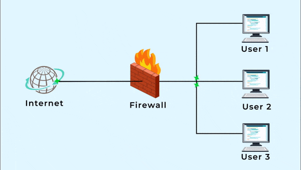

[**_``Go Back``_**](../README.md)

# Network Security

## Overview of Network Security
Network security refers to the policies, practices, and technologies used to protect networks and the data they transmit from unauthorized access, misuse, or attacks. The primary objectives of network security include ensuring the **confidentiality**, **integrity**, and **availability** of network resources. This involves safeguarding both the physical network infrastructure and the digital communications across it.

Key objectives include:
- **Confidentiality**: Ensuring that sensitive information is accessible only to authorized users.
- **Integrity**: Protecting data from being altered or tampered with.
- **Availability**: Ensuring that network services are available to authorized users when needed.

## Email Security: S/MIME, Pretty Good Privacy (PGP)
- **S/MIME (Secure/Multipurpose Internet Mail Extensions)**: A standard for public key encryption and signing of MIME data, providing **authentication, message integrity**, and **encryption**. It helps in protecting email communication from tampering and eavesdropping.
  
- **Pretty Good Privacy (PGP)**: A widely used method for securing emails using **public-key cryptography**. PGP provides encryption, decryption, and digital signatures for email communications, ensuring privacy, authentication, and integrity.

Both S/MIME and PGP are widely used for securing email content but differ in terms of their protocols and trust models.

## Secure Socket Layer (SSL) and Transport Layer Security (TLS)
- **SSL (Secure Socket Layer)**: A protocol developed to secure data transmission over the internet. SSL uses encryption to protect data, ensuring that it remains private during transmission. SSL has largely been replaced by TLS but is still referenced in some contexts.
  
- **TLS (Transport Layer Security)**: The successor to SSL, TLS is a more secure and efficient protocol used to encrypt data between client and server. TLS provides three primary security functions: **encryption**, **authentication**, and **data integrity**. Websites using HTTPS rely on TLS for securing communications.
  
  **TLS/SSL Handshake**: Involves a series of steps between the client and server to establish a secure connection, negotiate encryption keys, and authenticate both parties before transmitting data securely.

## IP Security (IPSec)
- **IPSec (Internet Protocol Security)**: A suite of protocols designed to secure IP communications by **authenticating** and **encrypting** each IP packet in a communication session. IPSec can be used in two modes:
  - **Transport Mode**: Only the data payload of the packet is encrypted, leaving the header untouched.
  - **Tunnel Mode**: Both the header and the payload are encrypted, offering full protection.

IPSec is commonly used in **Virtual Private Networks (VPNs)** to provide secure communication across public networks. Key components of IPSec include the **Authentication Header (AH)** and **Encapsulating Security Payload (ESP)** for ensuring data integrity and encryption.

## Firewalls and Their Types

**Firewall**: A security device or software that monitors incoming and outgoing network traffic and decides whether to allow or block specific traffic based on pre-defined security rules.

**Types of Firewalls**:
1. **Packet-Filtering Firewalls**: Examine packets against a set of rules based on source/destination IP addresses, ports, and protocols. They are simple but lack deep inspection capabilities.
   
2. **Stateful Inspection Firewalls**: Track the state of active connections and make decisions based on the state, context, and rules, offering better security than packet-filtering firewalls.

3. **Proxy Firewalls**: Operate at the application layer by acting as an intermediary between end-users and the resources they want to access. They provide deep packet inspection by analyzing the contents of messages before forwarding them.

4. **Next-Generation Firewalls (NGFW)**: Combine traditional firewall capabilities with advanced features like **intrusion prevention systems (IPS)**, **application awareness**, and **deep packet inspection**, offering comprehensive protection.

5. **Unified Threat Management (UTM) Firewalls**: A complete security solution that integrates multiple security features like firewall, VPN, anti-virus, and content filtering into one device.

Firewalls play a crucial role in network security by preventing unauthorized access and monitoring network traffic for potential threats.
