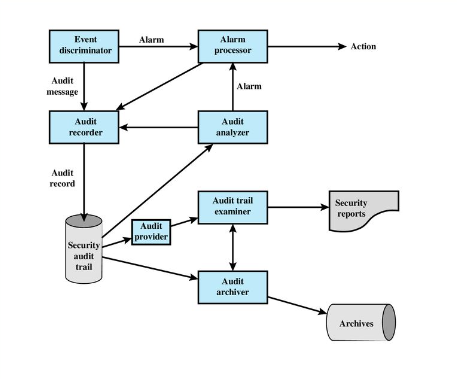
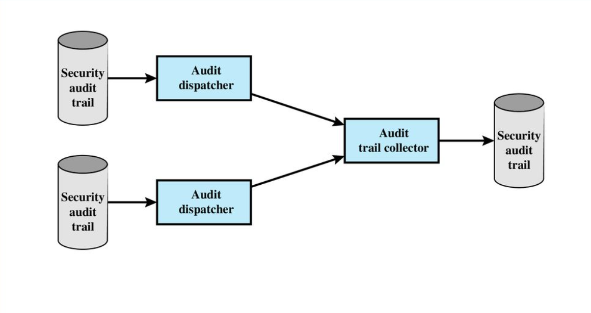

[**_``Go Back``_**](../README.md)

# Security Auditing

## Security Audit
A **security audit** is a systematic evaluation of an organization's information system security, including policies, controls, and procedures. The goal of a security audit is to ensure that systems are adequately protected against potential threats, vulnerabilities, and breaches. It involves assessing:
- **Compliance**: Ensuring that the organization follows established security standards and regulations.
- **Risk Management**: Identifying and mitigating risks to minimize the potential impact of security incidents.
- **Security Controls**: Evaluating the effectiveness of security controls in place, such as firewalls, encryption, and access controls.

## Security Auditing Architecture

Security auditing architecture includes the elements that required for auditing. It shows security auditing in broader context. ITU-T Recommendation X.816 develops a model that shows the elements of the security auditing function and their relationship to security alarms.

The key elements are as follows:

1. **Event Discriminator**
   - Detects security-related events based on configured criteria.

2. **Audit Recorder**
   - Receives and records detected events, either in shared memory or as messages.

3. **Alarm Processor**
   - Handles alarms triggered by certain events and records its own actions in the audit trail.

4. **Security Audit Trail**
   - A formatted record of all events stored by the audit recorder.

5. **Audit Analyzer**
   - Analyzes the audit trail to identify patterns, define new events, and generate alarms.

6. **Audit Archiver**
   - Periodically creates permanent archives of the audit trail records.

7. **Archives**
   - Permanent storage for security-related events.

8. **Audit Provider**
   - Interfaces for accessing the audit trail.

9. **Audit Trail Examiner**
   - Reviews the audit trail and archives for trends, forensic analysis, and other purposes.

10. **Security Reports**
    - Human-readable reports prepared from the audit trail.

### Distributed Auditing Components

For distributed systems, additional components include:

- **Audit Trail Collector**
  - Centralizes audit trail records from various systems into a combined audit trail.

- **Audit Dispatcher**
  - Sends local audit trail records to the centralized collector.

### Security Auditing Functions

The Common Criteria specification breaks down security auditing into six major areas:

1. **Data Generation**
   - Identifies the auditing level and types of auditable events.
   - Specifies the minimum set of audit-related information.
   - Balances security and privacy concerns, including user identity for certain events.

2. **Event Selection**
   - Includes or excludes events from the audit trail.
   - Configures the system to manage audit data granularity, preventing an overly extensive audit trail.

3. **Event Storage**
   - Creates and maintains a secure audit trail.
   - Ensures availability and prevents data loss.

4. **Automatic Response**
   - Defines actions taken upon detecting events that may indicate a security violation.

5. **Audit Analysis**
   - Uses automated mechanisms to analyze system activity and audit data for potential security violations.
   - Employs anomaly detection and attack heuristics to identify and analyze suspicious events.

6. **Audit Review**
   - Provides tools for authorized users to review audit data.
   - Includes functions for searching, sorting, and filtering audit data based on various criteria.

These functions collectively ensure effective security auditing by managing data generation, selection, storage, response, analysis, and review.

## Security Audit Trail
A **security audit trail** is a chronological record of security-related events and transactions within a system. It is essential for:
- **Tracking**: Monitoring user activities and identifying any suspicious or unauthorized behavior.
- **Incident Investigation**: Reconstructing events that led to a security breach.
- **Compliance**: Providing evidence of compliance with security policies and regulations.

Audit trails typically include logs of user actions, system changes, network traffic, and application events.

## Implementing Logging Function
**Logging** is the process of recording and storing information about system activities and security events. When implementing logging functions, it's important to:
- **Identify Critical Events**: Determine which events (e.g., login attempts, file access, configuration changes) need to be logged.
- **Log Retention Policies**: Establish how long logs will be stored based on compliance requirements and available storage capacity.
- **Secure Storage**: Ensure logs are stored securely and protected from tampering or unauthorized access.
- **Real-Time Monitoring**: Implement tools for real-time log analysis to detect security threats as they occur.

Effective logging helps in both proactive threat detection and post-incident analysis.

## Audit Trail Analysis
**Audit trail analysis** involves reviewing and interpreting audit logs to identify potential security issues. Key aspects include:
- **Pattern Recognition**: Identifying abnormal patterns that may indicate suspicious activities.
- **Correlating Events**: Linking related events across systems and timeframes to gain a complete picture of an incident.
- **Anomaly Detection**: Spotting deviations from normal behavior that could signal a security breach or misconfiguration.
- **Forensic Investigation**: Using audit trails to investigate the root cause of an incident and determine how to prevent future occurrences.

Audit trail analysis is crucial for maintaining a secure environment and ensuring compliance with security regulations.